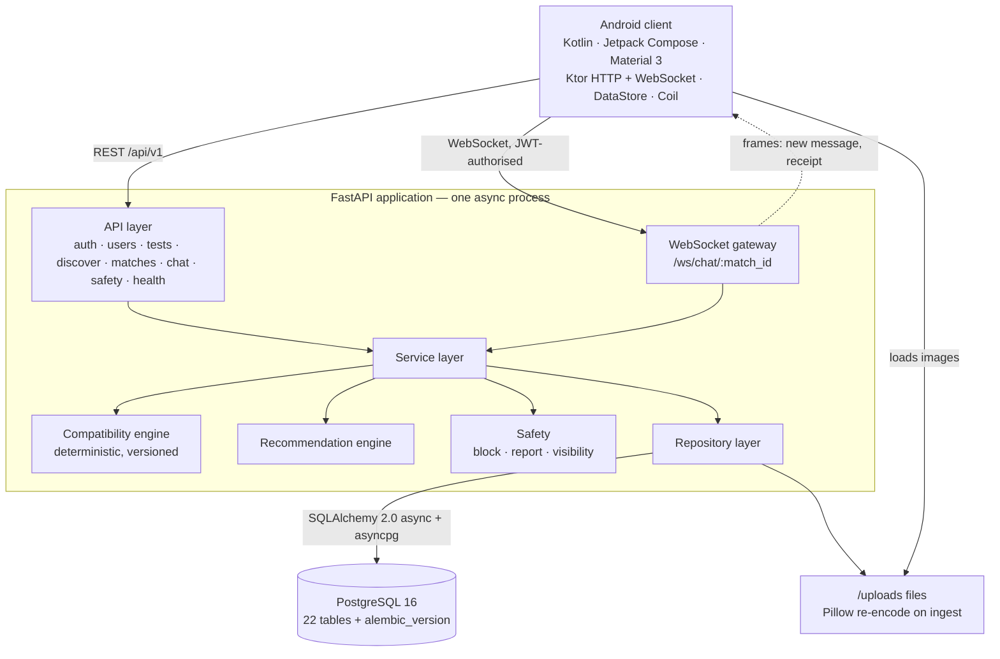

# BeFoS

**Explainable compatibility dating platform**


| | | |
|---|---|---|
|  |  |  |
| Auth | Onboarding | Compatibility test |
|  |  |  |
| Test result | Discovery | Compatibility breakdown |
|  |  |  |
| Mutual match | Chat | Date recommendations |

> BeFoS is a dating platform built around explainable multi-factor compatibility rather than
> opaque recommendations. Instead of ranking profiles by engagement, it scores a pair across
> seven weighted categories, shows **why** two people match, and proposes concrete activities
> the two of them can actually do together — computed from their real data, deterministically.

The compatibility score is an **engineering heuristic** built from questionnaires and a test.
It is not a psychological or medical diagnosis, and it is not presented as one anywhere in the
product.

## Overview

Two deliverables in one repository, both finished:

- **`backend/`** — async FastAPI service: JWT auth with rotating refresh tokens, profile and
  onboarding, a 21-question test, the compatibility engine, discovery with a stored deck and
  cursor pagination, matches, a WebSocket chat gateway, activity recommendations, safety
  (block/report), Alembic migrations over PostgreSQL 16.
- **`android/`** — Kotlin / Jetpack Compose client (Material 3, Ktor, Navigation Compose,
  DataStore, Coil) in a `data / domain / presentation` layering, covering every backend
  capability above.

Nothing in the flow is a stub: no random percentages, no fake profiles behind the UI, no
simulated realtime path. The seeded accounts exist so the product can be demoed, and they are
labelled as seeded.

## Why BeFoS

Mainstream dating apps optimise for time-in-app; the ranking that produces the deck is opaque,
and a match tells you nothing about why it happened. BeFoS inverts that:

- **The number is explainable.** Every category score is derived from stored answers, and the
  API returns the breakdown, the strongest points of agreement, the real differences, and the
  shared interests — all of it computed, none of it generated.
- **The same input always gives the same output.** The engine is deterministic and versioned
  (`engine_version` is persisted with each result), so a score can be reproduced and audited.
- **Symmetry is a tested property.** A pair gets the same percentage from either side; that is
  asserted by tests, not assumed.
- **The recommendation is actionable.** Instead of "you two should talk", the app proposes a
  specific activity from the catalogue that fits both profiles, their city and their answers.
- **Refusals are real.** Blocking deletes the pair and its history on the server, in both
  directions, including inside an already-open socket. It is not a feed filter.

## Product Flow

```
register → profile → interests → 21-question test → compatibility profile
        → discovery deck → like / pass → mutual match → chat (WebSocket)
        → compatibility breakdown → joint activity recommendation
```

Routing after login depends on how complete the profile is: a finished profile lands in the
main tab, an unfinished one goes back to onboarding rather than onto a screen that cannot work.

## Screenshots

Captured from the running app on an emulator (1080×2280) against the Docker backend, with
seeded demo data only. The interface language is Russian — the product was built for a Russian
speaking market, and screen strings live in the Compose code rather than in a resource bundle,
so there is no locale switch to show. Catalogue content (interests, questions, activities) is
Russian for the same reason.

| Screen | File | What it shows |
|---|---|---|
| Auth | [`01-auth.png`](screenshots/01-auth.png) | Sign-in / sign-up form |
| Onboarding | [`02-onboarding.png`](screenshots/02-onboarding.png) | Step 1 of 3: name, birth date, city, gender, about |
| Test | [`03-test.png`](screenshots/03-test.png) | Question 1 of 21, with the progress bar and four options |
| Test result | [`04-test-result.png`](screenshots/04-test-result.png) | Per-category profile after the test |
| Discovery | [`05-discovery.png`](screenshots/05-discovery.png) | Candidate card with score ring, shared interests and the data-derived reason it was shown |
| Compatibility | [`06-compatibility.png`](screenshots/06-compatibility.png) | Overall percent plus the seven category bars |
| Match | [`07-match.png`](screenshots/07-match.png) | Mutual-like moment with the pair's score |
| Chat | [`08-chat.png`](screenshots/08-chat.png) | Realtime conversation inside a pair |
| Recommendations | [`09-recommendations.png`](screenshots/09-recommendations.png) | Scored joint activities for the pair |
| Profile | [`10-profile.png`](screenshots/10-profile.png) | Own profile, test state, interests, privacy entry |

## Key Features

**Auth and session.** Access token plus refresh token; the refresh token is stored as a
SHA-256 hash and rotated on use. An expired session is treated as recoverable state: a failed
refresh clears tokens and the navigator returns the user to the sign-in screen with the email
prefilled, while a 5xx or a network failure keeps the session and leaves the user on a screen
where "Retry" can actually succeed. Verified on device by rotating the backend JWT secret.

**Profile and onboarding.** Three steps, validated where the thumb already is; interests chosen
from a 40-item catalogue with stable chip geometry (selecting one never moves its neighbours).

**Test.** 21 questions across seven categories, auto-advance, auto-submit on the last answer,
re-testable at any time; answers are stored per option and feed the engine.

**Discovery.** Candidates come from a stored, ranked deck read with cursor pagination, so
pages stay stable while the pool changes; a user who never answered the test is nobody's card.
Each card carries a `highlight` derived from the two profiles, not from a template.

**Matches and chat.** A mutual like creates a pair and stores the score the engine gives that
pair today. Messages are sent over REST and broadcast into the pair's WebSocket, so both
clients see them without a reload; a retried send reuses its idempotency key, so one tap stores
one message, and a reconnect reads the gap it missed.

**Compatibility detail.** Overall percent, seven category bars, strengths, differences, shared
interests — computed from both profiles.

**Recommendations.** Activities scored against both profiles, their city and their answers, and
refreshed when either profile changes.

**Safety.** Block (server-side, both directions, re-checked on every socket frame), report with
sendable reasons, profile visibility switch, account deletion that erases the data.

## Compatibility Engine

```
Score = Σ ( normalize(component_i) × weight_i ),   Σ weight_i = 1.0
```

| Category | Weight | Computed from |
|---|---|---|
| values | 0.25 | Trait similarity in the normalised answer vector (family, career, growth, stability, adventure) |
| personality | 0.15 | Trait similarity (extraversion, openness, planning, optimism) |
| interests | 0.15 | Overlap of the two users' interest sets — not the vector |
| communication | 0.15 | Trait similarity in the communication category |
| lifestyle | 0.15 | Trait similarity in the lifestyle category |
| leisure | 0.10 | Trait similarity in the leisure category |
| goals | 0.05 | Compatibility of the two declared dating goals — not the vector |

Weights live in `backend/app/compatibility/weights.py` and are validated to sum to 1.0; the
engine version is written into every stored result, so a score records the rules that produced
it. Alongside the percent the API returns the category breakdown, strengths, differences and
shared interests. Scoring is a pure synchronous function of the two vectors — no database, no
clock, no randomness inside the engine — which is what makes the determinism and symmetry tests
cheap to run.

## Architecture



There is one backend process, one database and one object store for uploads: no queue, no
cache tier, no microservice that does not exist. `docs/ARCHITECTURE.md` describes the layers,
the engines and the socket lifecycle; `docs/DATABASE.md` the schema and the pool math;
`docs/API.md` every endpoint. (Those three documents are written in Russian, and so is
`docs/DEPENDENCIES.md` — the pinning policy, the advisory audit and what it measured.)

## Technology Stack

| Layer | Technology |
|---|---|
| Backend | Python 3.12, FastAPI 0.115, Pydantic 2.10, SQLAlchemy 2.0 (async), asyncpg, Alembic 1.14 |
| Database | PostgreSQL 16 |
| Auth / security | JWT (access + rotating refresh, refresh stored as SHA-256 hash), bcrypt, CORS validation, sliding-window rate limiting, Pillow image re-encoding |
| Realtime | WebSocket `/ws/chat/{match_id}` authorised by JWT; REST-sent messages and receipts are broadcast into the pair's socket |
| Android | Kotlin 2.2, Jetpack Compose (BOM 2024.09), Material 3, Navigation Compose 2.8, Ktor 3.0, kotlinx-serialization, Coil 2.7, DataStore 1.1, Coroutines/Flow |
| Infrastructure | Docker Compose, pytest, JUnit4 + MockK + Turbine |

## Security

Implemented and covered by tests:

- **JWT authentication** with an access token (30 minutes by default) and a refresh token
  (30 days by default) that is **rotated on every use**; at rest the refresh token exists only
  as a SHA-256 hash, never as the value the client holds.
- **bcrypt password hashing**; passwords are never logged, and neither are access/refresh
  tokens — including the token that appears in a WebSocket handshake.
- **Object-level authorization (IDOR protection)** on every identifier-bearing route, with a
  dedicated test sweep that asserts a foreign id is refused rather than merely hidden.
- **WebSocket authorization**: the handshake checks the JWT and the pair membership, and each
  frame in an already-open socket re-checks them, so a socket cannot outlive its pair or a
  block (`1008` / `403`).
- **Rate limiting** with a sliding window, including a separate, tighter limiter on `/auth`,
  keyed on an address the client cannot forge.
- **Secure logging**: structured request logs carry request id, route, status and latency, and
  no user-supplied personal payload.
- **Upload validation**: images are read to a size ceiling and re-encoded through Pillow, so an
  oversized or malformed file is refused as input instead of becoming a 500 or a decompression
  bomb. The decoder is chosen from a list this product owns (`ACCEPTED_PIL_FORMATS`), not from
  the bytes a client labelled: `Image.open` picks its parser from the magic in the body, so
  without that second gate a JPEG-declared PSD or TIFF reaches a decoder no photo needs.
- **Third-party components**: runtime dependencies are pinned exactly, test tooling lives in a
  separate file so the serving image carries no test runner, and the resolved graph — 39 pip and
  165 Maven artefacts — is auditable against GitHub's advisory database with
  `backend/ops/check_advisories.py`. Policy, alert inventory and what was deliberately left
  alone: [`docs/DEPENDENCIES.md`](docs/DEPENDENCIES.md).
- **Production configuration validation**: with `ENVIRONMENT=production` the service refuses to
  start on placeholder or short JWT secrets, on identical access/refresh secrets, on a
  wildcard or `http://` CORS origin, on `DEBUG=true`, on the demo account being enabled (its
  password is printed in this repository, so it is shared access, not convenience), on the
  database password this repository ships with for development, and on an unrecognised value
  of `ENVIRONMENT` itself — a typo there would otherwise silently disable every other check.
- **Account deletion as a data lifecycle**: the row is kept so referential integrity and pair
  history survive, and everything that still describes the person is erased — test answers,
  results, compatibility vector, activity affinity, deck entries — while `birth_date`,
  `gender`, `dating_goal` and preferences are set to values no form can produce. Uploaded photo
  rows and their files are removed too, because `/uploads` is public static and hiding a profile
  does not stop a URL being served. Reports deliberately survive deletion.
- **Block and report**: a block removes the pair and its messages, returns 404 for history and
  sending in both directions, and is re-checked on socket handshake and per frame.
- **CORS validation**: wildcard origin combined with credentials is rejected at startup.

This section deliberately omits implementation details that would make abuse easier; the
behavioral guarantees above are what the test suite asserts.

## Reliability

- **Migrations** are Alembic revisions, applied on container start; `alembic check` is clean
  against the models, and each revision has a working downgrade path.
- **Backups** are documented as a procedure with a verified restore drill: `pg_dump`, a
  fingerprint query, restore into a scratch database, compare, drop. A copy that has not been
  restored is not a backup, so the drill is written down with its numbers in
  `docs/OPERATIONS.md`.
- **Health probes**: a liveness endpoint and a database-backed readiness endpoint, so an
  orchestrator can tell "process up" from "can serve".
- **Pool math** is documented rather than guessed: size, overflow and `pool_recycle` are
  justified against the Postgres `max_connections` in this stand.
- **Race conditions closed by constraints**: repeated likes, double test submissions and
  duplicate messages are settled by the database, not by a check-then-insert in Python.
- **Chat idempotency**: a send carries a client-generated key, so a retry after a lost response
  stores one message; a reconnect backfills what the socket missed.
- **Observability**: every request gets an id, a duration and a structured line, which is what
  made the latency and N+1 fixes measurable.
- **Performance**: the discovery feed and the match list stopped paying N+1; the two hot reads
  that scanned a whole table now scan a page; discovery reads a stored deck instead of
  re-ranking the pool per request. Query-count ceilings are asserted by tests.
- **Release integrity**: a release build cannot be produced against the emulator address —
  packaging fails unless explicit `https://`/`wss://` backend URLs are supplied, and the check
  is made against the artifacts the task graph actually produces.

## Testing

Re-run before quoting these numbers; they were measured on 2026-10-06 against this tree:

| Suite | Result | Command |
|---|---|---|
| Backend (unit + integration + security config + IDOR + perf + pagination + observability + DB reliability + media + chat idempotency + compatibility consistency + dependency security regressions) | **235 passed** | `cd backend && pytest` |
| Android unit (ViewModels and pure functions) | **131 passed, 0 failed** | `cd android && ./gradlew :app:testDebugUnitTest` |
| Live product journey against the running Docker backend, two real accounts | **64 / 64 checks** | `cd backend && python e2e_journey.py` |
| On-device run on an emulator | manual, full flow: register → onboarding → test → discovery → match → chat → compatibility → recommendations → pairs → profile → settings → logout → re-login | AVD `befos_avd` (pixel_4, 540×1140 / density 220), headless |

The backend suite creates its own `befos_test` database against the Docker Postgres on
`localhost:5432`, so a running `docker compose up -d` is the only prerequisite; the target
cluster can be overridden with `BEFOS_TEST_PG_HOST/PORT/USER/PASSWORD/DB`.

The E2E journey drives the whole value chain with two real accounts — registration, onboarding,
test, discovery, mutual like, match, chat over the socket, compatibility, recommendations,
block/visibility, refresh, logout, re-login, account deletion — plus the negative security
cases, including the data-derived card reason.

Layout and input are measured rather than eyeballed: the responsive matrix at 320/360/411/540 dp
and font scale up to 1.3, the keyboard/IME clearance on every text screen, and the interest-chip
geometry (a tap moves none of its six neighbours; the chip's touch target is exactly 48 dp).

## Development History

Six days of history, kept whole rather than squashed — the versions that were later replaced are
still addressable by commit. Recount at any time with `git rev-list --count HEAD`.

| Stage | When | What changed |
|---|---|---|
| Foundation | 2026-10-01 | Backend with the compatibility engine, Compose client, first tests, first docs |
| Realtime, auth rules, performance | 2026-10-02 | WebSocket chat, session routing, fail-fast config, IDOR suite, N+1 removal, release signing |
| Visual redesign | 2026-10-02 | Token system and component rebuild, every screen migrated |
| UX excellence | 2026-10-03 | Honest failure states, skeletons, navigation state, copy voice |
| Adversarial QA, reliability | 2026-10-04 | Forged-header limiter, races, socket lifecycle, media limits, observability, idempotency |
| Accessibility, privacy, engine consistency | 2026-10-05 | Keyboard/IME matrix, contrast, deletion lifecycle, symmetric scores, production guards |
| Launch readiness | 2026-10-06 | Ignore rules, loopback-only database, shipped-password guard, license, screenshots |
| Dependency security hardening | 2026-10-06 | 40 alerts closed by four patched pins, decoder whitelist, non-root two-stage image, advisory audit tool, 44 new regressions |

Full stage-by-stage detail, with the commit evidence behind each row:
[`docs/DEVELOPMENT_HISTORY.md`](docs/DEVELOPMENT_HISTORY.md).

## Running Locally

### Backend with Docker (recommended)

```bash
cp .env.example .env        # edit the secrets if you like
docker compose up --build
```

Compose starts PostgreSQL and the backend, applies migrations (`alembic upgrade head`), seeds
the catalogues and demo data (`python -m app.seed --if-empty`) and serves the API on
`http://localhost:8000`. Interactive docs: `http://localhost:8000/docs`.

The development compose file publishes PostgreSQL on `127.0.0.1:5432` only, so a stray
`docker compose up` on a machine with a routable interface does not expose the database.

### Backend without Docker

```bash
cd backend
python -m venv .venv && source .venv/Scripts/activate   # Windows Git Bash
pip install -r requirements-dev.txt                      # runtime + the test tooling
cp ../.env.example .env                                  # point DATABASE_URL at your PostgreSQL
alembic upgrade head
python -m app.seed
uvicorn app.main:app --reload --port 8000
```

`requirements.txt` is what the container installs — runtime only, pinned exactly.
`requirements-dev.txt` pulls that file in and adds `pytest`, `pytest-asyncio` and `httpx`, which
never reach the image. The pins and the reasons behind them:
[`docs/DEPENDENCIES.md`](docs/DEPENDENCIES.md).

### Android

Open `android/` in Android Studio, or build from the CLI:

```bash
cd android
./gradlew :app:assembleDebug     # app/build/outputs/apk/debug/app-debug.apk
```

The emulator reaches the host at `10.0.2.2`, so a backend on `localhost:8000` needs no extra
configuration (see `API_BASE_URL` in `android/app/build.gradle.kts`). A physical device can use
`adb reverse tcp:8000 tcp:8000`.

### Release build

```bash
cd android
export BEFOS_API_BASE_URL="https://api.example.com/" BEFOS_WS_BASE_URL="wss://api.example.com/"
# optional signing: copy android/keystore.properties.example to android/keystore.properties
# (outside git). Without it the build honestly produces an unsigned APK/AAB — never a debug key.
./gradlew :app:assembleRelease :app:bundleRelease
```

Without those two variables packaging fails with a clear message: an accidental release pointed
at the emulator's HTTP address is not possible. The address must be `https://`/`wss://`, must
not embed credentials, and must not be `localhost`/`10.0.2.2`. Signing, artifact verification
with `apksigner`, the R8 mapping and the pre-publication checklist are in
[`docs/RELEASE.md`](docs/RELEASE.md).

### Tests

```bash
cd backend && pytest                                   # 235
cd android && ./gradlew :app:testDebugUnitTest         # 131
cd backend && python e2e_journey.py                    # 64 checks, needs the Docker backend up
```

Dependencies are checked the same way as the suites — by running something rather than by
trusting a badge:

```bash
docker exec befos_backend python -m pip freeze | python backend/ops/check_advisories.py --pip-stdin
```

It asks GitHub's advisory database about the *resolved* graph and exits 1 on any hit;
[`docs/DEPENDENCIES.md`](docs/DEPENDENCIES.md) has the Gradle-side command and the 2026-10-06
measurement.

## Demo

With `DEMO_ENABLED=true` (the default in `.env.example`, and refused in production):

```
email:    demo@befos.app
password: Demo12345
```

The seed also creates 50 clearly fictional demo personas with synthetic answers so discovery,
matching and recommendations have something real to compute on. With `DEMO_ENABLED=false` the
seed loads only the catalogues (interests, questions, activities) and invents nobody.

[`DEMO.md`](DEMO.md) is a 5–10 minute script of the full value chain (steps 0–17, in the order
the product is meant to be shown), including the realtime frame test and the two irreversible
actions to run on a throwaway account.

## Project Status

Working and verified: everything in the flow above, on the current tree, on an emulator and
against the Docker backend — plus the three suites and the live journey.

Not done, stated plainly:

- **No deployment.** The service runs locally or in Docker Compose on one host; there is no
  hosted instance, no TLS termination and no CI in this repository.
- **No push notifications.** The design against the existing seams is written down
  (`docs/ARCHITECTURE.md`), the implementation is not — deliberately, because it needs a
  project credential.
- **No admin panel.** Reports are stored and survive deletion of the reporter's account, but
  reading and resolving them currently means SQL (`docs/OPERATIONS.md` §14).
- **Unblocking is not in the app.** A block is permanent from the client; removal is a
  documented SQL operation and does not restore the pair or its history.
- **Backups are manual.** There is a verified drill, not a scheduler, and no off-host copy.
- **No point-in-time recovery.** The recovery point is the last dump.
- **One database, no replica.** A heavy report runs on working connections.
- **`/uploads` is unauthenticated static.** Privacy there rests on unpredictable file names and
  on deleting the file with the account, not on a permission check.
- **Android unit tests need an ASCII path on Windows.** From a directory containing non-ASCII
  characters the Gradle test worker dies with `ClassNotFoundException` for every class
  (`sun.jnu.encoding=Cp1251`); the same 131 tests pass from an ASCII path, as they did for the
  numbers above. Application builds are unaffected.

## Roadmap

In the order the gaps above actually block something:

1. Deploy the backend behind TLS with real secrets, and prove the production config gates
   against a live environment rather than a local one.
2. Put the three suites and `backend/ops/check_advisories.py` in CI, so "235 / 131 / 64" and
   "0 affected" stop being manual measurements.
3. Push notifications, following the already-written design (device-token storage, per-pair
   delivery rules, opt-out) once a project credential exists.
4. A moderation reader for reports, so a complaint has a recipient who is not a `psql` prompt.
5. Scheduled backups with an off-host copy and a periodically re-run restore drill; PITR after
   that.
6. In-app unblock with an explicit statement that it does not resurrect the deleted pair.
7. Signed release distribution (Play internal track) and a versioning policy on top of the
   existing release gate.

## License

Proprietary. **All Rights Reserved** — see [`LICENSE`](LICENSE).

> © 2026 Andrew Kolesnikov. All rights reserved.
> The repository is published for portfolio, educational review and demonstration purposes.
> No license is granted to copy, redistribute, modify, sublicense or commercially use the
> source code without explicit written permission.

The absence of an open-source license is not an oversight: no open-source permission is granted
here, and **reuse is not permitted** — that includes porting the compatibility engine, reusing a
module, embedding the APK or hosting a copy. Reading the code and history, and building it
locally unmodified for review or study, is permitted, as are short attributed quotations; the
exact terms are in `LICENSE`. Third-party components remain under their own licenses and are
named in [`THIRD_PARTY_NOTICES.md`](THIRD_PARTY_NOTICES.md). This is a plain statement of the
author's intent, not legal advice.

BeFoS is maintained as a proprietary portfolio/product project. **External contributions are
not accepted at this time** — there is no `CONTRIBUTING.md`, and pull requests will not be
merged. Permission requests can be made through the author's GitHub profile (Andrew05812).
