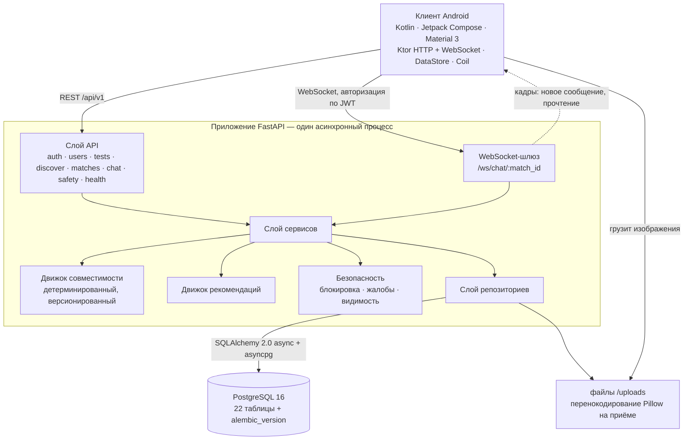

# BeFoS

**Платформа знакомств с объяснимой совместимостью**


| | | |
|---|---|---|
|  |  |  |
| Вход | Анкета | Тест |
|  |  |  |
| Результат теста | Поиск | Разбор совместимости |
|  |  |  |
| Взаимная симпатия | Чат | Рекомендации для свидания |

> BeFoS — платформа знакомств, в которой совместимость считается по семи взвешенным
> категориям и показывается человеку вместе с числом. Не «вот вам 87% и верьте на слово», а
> «вот что у вас общего, вот в чём вы разошлись, и вот чем вам двоим заняться вместе». Всё это
> вычисляется из реальных ответов профилей, детерминированно, без генерации текста.

Процент совместимости — **инженерная эвристика**, построенная на опросниках и тесте. Это не
психологическая или медицинская диагностика, и в продукте она нигде так не подаётся.

## Что это за проект

В одном репозитории два законченных артефакта:

- **`backend/`** — асинхронный FastAPI-сервис: JWT-аутентификация с ротацией refresh-токенов,
  профиль и анкета, тест из 21 вопроса, движок совместимости, поиск с хранимой колодой и
  пагинацией по курсору, пары, WebSocket-шлюз чата, рекомендации совместных активностей,
  безопасность (блокировка и жалобы), миграции Alembic поверх PostgreSQL 16.
- **`android/`** — клиент на Kotlin / Jetpack Compose (Material 3, Ktor, Navigation Compose,
  DataStore, Coil) с разбиением `data / domain / presentation`, покрывающий каждую возможность
  бэкенда выше.

В этом потоке нет заглушек: ни случайных процентов, ни фейковых профилей за интерфейсом, ни
имитации realtime-канала. Засеянные аккаунты существуют, чтобы продукт можно было показать, и
они помечены как засеянные.

## Почему BeFoS, а не очередное приложение для знакомств

Приложение для знакомств оптимизируют по времени в интерфейсе; ранжирование, которое даёт
колоду, непрозрачно, а матч ничего не говорит о том, почему случился. BeFoS переворачивает это:

- **Число объяснимо.** Каждый балл категории выведен из сохранённых ответов, и API возвращает
  разбор по категориям, точки совпадения, реальные расхождения и общие интересы — всё
  вычислено, ничего не сгенерировано.
- **Одинаковый вход даёт одинаковый выход.** Движок детерминирован и версионирован
  (`engine_version` сохраняется вместе с каждым результатом), поэтому процент можно
  воспроизвести и проверить.
- **Симметрия — проверенное свойство.** Пара получает одинаковый процент с обеих сторон; это
  утверждено тестами, а не принято по умолчанию.
- **Рекомендация применима.** Вместо «вам стоит поговорить» приложение предлагает конкретную
  активность из каталога, которая подходит обоим профилям, их городу и их ответам.
- **Отказ реальный.** Блокировка удаляет пару и её историю на сервере, в обе стороны, включая
  внутри уже открытого сокета. Это не фильтр ленты.

## Продуктовый поток

```
регистрация → профиль → интересы → тест из 21 вопроса → профиль совместимости
        → колода поиска → симпатия / пропуск → взаимный матч → чат (WebSocket)
        → разбор совместимости → рекомендация совместной активности
```

После входа маршрутизация зависит от того, насколько заполнен профиль: законченный попадает на
главную вкладку, незаполненный — обратно в анкету, а не на экран, который не может работать.

## Экраны

Сняты с работающего приложения на эмуляторе (1080×2280) против Docker-бэкенда, только на
засеянных демо-данных. Язык интерфейса — русский: продукт делался для русскоязычного рынка, а
строки экранов живут в коде Compose, а не в ресурсном бандле, поэтому переключателя локали нет.
Содержимое каталогов (интересы, вопросы, активности) по той же причине русское.

| Экран | Файл | Что на нём |
|---|---|---|
| Вход | [`01-auth.png`](screenshots/01-auth.png) | Форма входа и регистрации |
| Анкета | [`02-onboarding.png`](screenshots/02-onboarding.png) | Шаг 1 из 3: имя, дата рождения, город, пол, о себе |
| Тест | [`03-test.png`](screenshots/03-test.png) | Вопрос 1 из 21, с прогресс-баром и четырьмя вариантами |
| Результат теста | [`04-test-result.png`](screenshots/04-test-result.png) | Профиль по категориям после теста |
| Поиск | [`05-discovery.png`](screenshots/05-discovery.png) | Карточка кандидата с кольцом процента, общими интересами и причиной показа, выведенной из данных |
| Совместимость | [`06-compatibility.png`](screenshots/06-compatibility.png) | Общий процент и семь полос категорий |
| Матч | [`07-match.png`](screenshots/07-match.png) | Момент взаимной симпатии с процентом пары |
| Чат | [`08-chat.png`](screenshots/08-chat.png) | Живой диалог внутри пары |
| Рекомендации | [`09-recommendations.png`](screenshots/09-recommendations.png) | Оценённые для пары совместные активности |
| Профиль | [`10-profile.png`](screenshots/10-profile.png) | Свой профиль, состояние теста, интересы, вход в приватность |

## Что умеет

**Аутентификация и сессия.** Access-токен плюс refresh-токен; refresh хранится как SHA-256 хеш
и ротится при каждом использовании. Протухшая сессия — восстановимое состояние: неудачный
refresh очищает токены, а навигатор возвращает человека на экран входа с уже подставленной
почтой; 5xx или сетевой сбой, наоборот, сессию сохраняют и оставляют на экране, где «Повторить»
может сработать. Проверено на устройстве подменой JWT-секрета бэкенда.

**Профиль и анкета.** Три шага, валидация там, где уже находится большой палец; интересы из
каталога на 40 позиций со стабильной геометрией чипов (выбор одного не сдвигает соседей).

**Тест.** 21 вопрос в семи категориях, автопереход, автоотправка на последнем ответе, перепройти
можно в любой момент; ответы хранятся по вариантам и питают движок.

**Поиск.** Кандидаты берутся из хранимой ранжированной колоды и читаются курсором, поэтому
страницы не съезжают, пока пул меняется; тот, кто не проходил тест, не становится чьей-то
карточкой. На каждой карточке лежит `highlight`, выведенный из двух профилей, а не из шаблона.

**Пары и чат.** Взаимная симпатия создаёт пару и сохраняет процент, который движок даёт этой
паре сегодня. Сообщения уходят через REST и рассылаются в WebSocket пары, так что оба клиента
видят их без перезагрузки; повтор отправки переиспользует ключ идемпотентности, поэтому одно
касание — одно сообщение, а переподключение дозагружает пропущенный разрыв.

**Разбор совместимости.** Общий процент, семь полос категорий, сильные стороны, расхождения,
общие интересы — считается по обоим профилям.

**Рекомендации.** Активности, оценённые по обоим профилям, их городу и ответам, и обновляются,
когда меняется любой из профилей.

**Безопасность.** Блокировка (на сервере, в обе стороны, перепроверяется на каждом кадре
сокета), жалобы с пересылаемыми причинами, переключатель видимости профиля, удаление
аккаунта, которое стирает данные.

## Движок совместимости

```
Score = Σ ( normalize(component_i) × weight_i ),   Σ weight_i = 1.0
```

| Категория | Вес | Из чего считается |
|---|---|---|
| values | 0.25 | Близость черт в нормализованном векторе ответов (семья, карьера, рост, стабильность, приключения) |
| personality | 0.15 | Близость черт (экстраверсия, открытость, планирование, оптимизм) |
| interests | 0.15 | Пересечение множеств интересов двух людей — не вектора |
| communication | 0.15 | Близость черт в категории общения |
| lifestyle | 0.15 | Близость черт в категории уклада жизни |
| leisure | 0.10 | Близость черт в категории досуга |
| goals | 0.05 | Совместимость двух названных целей знакомства — не вектора |

Веса лежат в `backend/app/compatibility/weights.py` и проверены на сумму 1.0; версия движка
записывается в каждый сохранённый результат, то есть число хранит правила, по которым оно
посчитано. Кроме процента API отдаёт разбор по категориям, сильные стороны, расхождения и общие
интересы. Оценивание — чистая синхронная функция двух векторов: без базы, без часов, без
случайности внутри движка. Именно поэтому тесты детерминизма и симметрии дёшевы в запуске.

## Архитектура



Один процесс бэкенда, одна база и одно хранилище файлов для загрузок: ни очереди, ни кэш-слоя,
ни микросервиса, которого не существует. [`docs/ARCHITECTURE.md`](docs/ARCHITECTURE.md) описывает
слои, движки и жизнь сокета; [`docs/DATABASE.md`](docs/DATABASE.md) — схему и арифметику пула;
[`docs/API.md`](docs/API.md) — каждый эндпоинт; [`docs/DEPENDENCIES.md`](docs/DEPENDENCIES.md) —
политику пинов, аудит advisory и что именно он замерил;
[`docs/SCALE_PLAN.md`](docs/SCALE_PLAN.md) — что происходит с горячими путями на объёме: замеры
тринадцати путей на 1 000, 10 000 и 50 000 анкет, к чтениям приложен план `EXPLAIN ANALYZE` (путь
завершения теста снят без планов — стадия 22 убирает обращение, а не форму запроса), парные
прогоны «до / после» для правок стадий 19, 20, 21, 22, 24, 25, 26, 27, 28, 30, 31, 32 и 33, вывод
о том, какое чтение остановится первым, и записанная честно оговорка: абсолютные медианы
этого стенда между вечерами плывут,
поэтому сравнивать можно только прогоны одной конфигурации. Стадия 23 (запись профиля) в этот
документ не просится: она сняла письма и два чтения одной строки по уникальному индексу, а проба
считает чтения на тысячах анкет, — поэтому у неё только числа обращений, без миллисекунд. Стадия
24 (страница рекомендаций пары) в него просится: снятие обращений пришлось ровно на тот путь,
который проба меряет, и тот же вечер дал парный прогон с контролем — 13 чтений стали 8, медианы
82.8 / 80.6 / 81.9 мс на 1 000, 10 000 и 50 000 упали до 58.0 / 57.8 / 58.0, а контрольный
`chat_history` за тот же вечер сдвинулся на −1.5 / −1.2 / −6.0 %. Стадия 25 (экран совместимости
пары) меряется тем же способом: 6 чтений за вызов стали 3, медианы 31.9 / 32.9 / 32.1 мс упали до
21.5 / 21.5 / 21.1 при том же контроле, сдвинутом на −5.7 / −2.1 / −0.6 %. Стадия 26 (маршрут лайка)
принесла в стенд одиннадцатый путь и сняла на нём 12 чтений до 10: медианы 83.9 / 74.5 / 70.0 мс
стали 77.9 / 65.1 / 66.1 мс, а контроль сдвинулся на +8.1 / −5.4 / −0.3 % — на 1 000 его ход оказался
больше сдвига пути, и выигрыш по времени там не утверждается. Стадия 27 (страница колоды, которой
нечего отдать) принесла в стенд двенадцатый путь и сняла на нём 9 обращений до 7: медианы
125.4 / 318.4 / 1247.0 мс стали 57.3 / 64.7 / 427.5 мс при контроле +13.3 / −11.5 / −6.0 %, и это
первая строка таблицы, у которой рост с объёмом виден напрямую — правка обращений его не снимает,
поэтому порог на него стоит в таблице «Триггеры». Стадия 28 меряется на уже стоявшем пути:
дозаполненная страница поднимала одних и тех же кандидатов дважды за запрос, на `discovery_rebuild`
16 обращений стали 13 (тестовый слушатель на одной странице показал 19 против 16), медианы
240.8 / 327.8 / 272.8 мс — 210.9 / 290.0 / 247.4 мс. Выигрыша по времени эта пара не утверждает:
контрольный `chat_history` сдвинулся на −6.0 / −9.5 / −0.6 %, а нетронутый правкой `discovery_page`
ушёл на −6.5 / +4.7 / +5.4 % — в том же порядке величины, что и сам путь. Там же записана оговорка на
прошлое: стенд стадии 20 стоял с пустой таблицей `activities`, поэтому его строка «рекомендации»
меряла не генерацию страницы. Стадия 29 (запись профиля поднимала его список интересов дважды)
остаётся за этим документом по той же причине, что и стадия 23: маршрутов записи анкеты среди
путей стенда нет, а снятое обращение выбирает строки по ведущей колонке
`uq_user_interest (profile_id, interest_id)` — не больше тридцати на анкету, то есть его цена не
зависит от числа анкет в базе. Поэтому у стадии только числа обращений, без миллисекунд. У стадии 35
(правка одного города перечитывала процент всех пар, в котором города нет) миллисекунды всё же есть,
и сняты они третьим прибором: четыре текста обращений, напечатанных слушателем на прежнем дереве,
переиграны asyncpg'ом против базы стенда на зрителе с шестьюдесятью парами — блок 14.031 / 13.610 /
14.093 мс при серверном времени самого блока 1.709 мс. Стадия 30
(страница пары поднимала каждого из двоих своими обращениями) в этот документ попросилась сама:
она принесла в стенд тринадцатый путь `match_detail` и сняла на нём 8 чтений до 5 — медианы
53.8 / 52.8 / 53.4 мс стали 47.1 / 38.0 / 44.5 мс, но контроль `chat_history` за тот же вечер
сдвинулся на +6.6 / +26.8 / +9.5 %, и на 10 000 его ход в девять раз больше сдвига пути, поэтому
выигрыша по времени прогон не утверждает: число обращений — 10 → 7 на HTTP-маршруте, снятое
слушателем. Стадия 31 (карточка по правилу колоды поднимала двоих теми же одиночными чтениями, что
и страница пары до предыдущей правки) меряется на уже стоявшем пути: `public_profile` — это тот же
`get_public_profile`, только правилом колоды, и в паре одной команды его 8 чтений стали 5, медианы
51.3 / 55.3 / 58.3 мс стали 39.5 / 34.6 / 36.1 мс, а контроль `chat_history` за тот же вечер
сдвинулся на +6.6 / −0.5 / −12.4 %. Здесь выигрыш по времени утверждается, и решает то же сравнение:
сдвиг пути больше хода контроля по модулю на всех трёх масштабах, а на 1 000 они ещё и
разнонаправлены; слушателем на HTTP-маршруте те же правки дают 9 → 6 обращений. Стадия 32
пересняла наконец сам `chat_history`, который семью прогонами был контролем: повтор вокруг открытия
чата был не в чтении, а в квитанции о прочтении — `SELECT` приносил id непрочитанных сообщений, а
`INSERT` отправлял те же id обратно. Слушателем 8 обращений стали 7, а 6 у `POST /read` стали 5;
при пустой очереди число обращений не изменилось (7 и 5), потому что прежний код на пустом списке
выходил до вставки. Прогон стенда выигрыша по времени не утверждает, и в README это записано
отдельно: медиана пути 31.7 / 30.9 / 30.8 мс стала 34.2 / 37.1 / 39.1 мс, 15 повторов на 10 000 дали
+10.9 % при нетронутых контролях +5.2 % и −6.7 %, а счётчик пробы уменьшился (6 → 5) и там, где круг
к базе не менялся, потому что проба считает только `SELECT`/`WITH`. Прямое сравнение двух форм
запроса на той же базе (60 чередующихся повторов) объясняет, где правда: прибавка 0.056…0.085 мс,
когда отмечать нечего, и снятые 2.3…4.0 мс и один круг к базе, когда ждут 4, 12 или 120 сообщений.
Стадия 33 разобрала то, что стадия 32 записала следующей очередью: список пар поднимал таблицу
`messages` дважды по одним и тем же id матчей — `distinct on (match_id)` ради последней строчки
переписки и `count(messages.id)` ради счётчика непрочитанных. Одна забота теперь умещается в одно
обращение: счётчик стал оконной агрегатной функцией поверх того же разбора по парам, и строку,
которую `DISTINCT ON` оставляет как самую свежую, он приносит вместе с собой. Слушателем 6 обращений
стали 5, и второе чтение `messages` исчезло из прогона совсем; проба на трёх масштабах даёт 4
обращения вместо 5 — здесь, в отличие от стадии 32, `SELECT` заменился `SELECT`-ом, поэтому сдвиг
её счётчика и есть настоящий сдвиг кругов к базе. Прямое сравнение двух форм запроса на той же базе
стенда (60 чередующихся повторов на аккаунте с 120 сообщениями в одной паре) даёт 6.681 → 3.634,
6.740 → 3.741 и 7.198 → 3.932 мс при двух кругах к базе против одного, то есть снятое обращение
стоит порядка 2.7–3.3 мс на вызов. Парной прогон стенда подтверждает это только на 50 000: медиана
пути 40.9 мс стала 34.3 (−16.1 %), а контроль `chat_history` за тот же вечер сдвинулся на +2.6 %;
на 1 000 и 10 000 ход контролей (−12.2 % и −21.8 % у `chat_history` и `recommendations`) больше
сдвига пути (−3.9 % и −18.1 %), поэтому выигрыша по времени эти два масштаба не утверждают.
Стадия 34 посмотрела на маршруты сессии. `POST /auth/refresh` и `POST /auth/logout` оба заканчиваются
одной записью в `refresh_tokens` и оба поднимали эту строку заранее, хотя решала её не прочитанная
строка, а сама запись: погашение — это `UPDATE … WHERE revoked is false`, чей счётчик строк и
отвечает, жив токен или уже погашен. Слушателем ротация стала 3 обращениями вместо 4, выход — 1
вместо 2, а контроль `POST /auth/login` остался на 2. На стенде эти пути не измерялись и в README
это записано отдельно: в `refresh_tokens` базы стенда 0 строк, самих маршрутов в списке наблюдаемых
нет, а снятое обращение приносит ровно одну строку по ведущей колонке `ix_refresh_tokens_token_hash`
— его цена не зависит от числа анкет. Миллисекунды сняты переигровкой обеих форм через asyncpg против
dev-базы с 642 строками токенов: 60 чередующихся повторов, медиана 7.366 → 4.745 мс, то есть
+2.621 мс на вызов; `EXPLAIN (ANALYZE, BUFFERS)` показывает, что новый `UPDATE` идёт по тому же
индексу, что и убранный `SELECT` (0.348 мс против 0.402 мс у прежнего `UPDATE` по первичному ключу),
— значит подешевел разговор с сервером, а не план. Подорожало одно: подпись, у которой строки в
таблице нет, отказывает теперь в 2 обращения вместо 1. Один текст отказа в углу (токен без строки при
деактивированной анкете) сдвинулся с «Refresh token has been revoked.» на «User no longer active.» —
снято прогоном на обоих деревьях, статус на обеих ветках 401.
Стадия 35 задала вопрос не о числе обращений внутри одного маршрута, а о том, чьи обращения там
оказались. `PATCH /users/me` трактует три поля — интересы, город и цель — одним триггером: правка
любого из них роняла кэш страницы активностей пары и перечитывала процент всех пар человека.
Процент движок строит из вектора ответов, набора интересов и цели (`app/compatibility/engine.py:19`),
и города среди его входов нет: слушатель на аккаунте с одной парой дал 11 обращений на правку одного
города, четыре из них — тот самый пересчёт, который возвращает на место прочитанное число. Стадии 26
и 34 правили «решает запись, а не чтение»; здесь решал состав входа. Появился отдельный набор
`_SCORE_FIELDS`, и веер запускается только правкой interests или цели, а город остался триггером
кэша, который он действительно меняет. Слушателем 11 → 7, и три контроля в том же прогоне не
сдвинулись: интересы 15, цель 13, одно текстовое поле 6. На объёме пара говорит то же число другим
прибором: переигровка четырёх снятых текстов против базы в 50 001 анкету на зрителе с шестьюдесятью
парами даёт блок 14.031 / 13.610 / 14.093 мс при серверном времени самого блока 1.709 мс, 877
попаданиях в кэш и нуле чтений с диска — цену правки города держит разговор с сервером, а не обход
строк. Правка вскрыла предписание: `docs/OPERATIONS.md` §16 чинил посеянный процент правкой города,
и после этой стадии оно стало бы тихой операцией без результата. Предписание переставлено на цель
отношений и проверено на живом dev-стенде против пересобранного образа: посеянные `82` правка города
оставила как были (`82` при живых `63`), правка цели, равной текущей, вернула `stored == live`, и
тот же признак после этого даёт 0 расхождений из восьми пар демо-аккаунта.
Стадия 36 сменила прибор: слушатель `before_cursor_execute` стал запоминать не только текст
обращения, но и его параметры, и печатать пары, встретившиеся внутри одного запроса дважды. На
двух маршрутах записи анкеты он дал одну и ту же пару дважды — строку профиля поднимали перед
записью и ещё раз после `commit`, ради сборки ответа; на переключателе видимости дубликата не
было, а на удалении аккаунта строка читалась один раз и до правки (20 обращений на обоих
деревьях). Прежний комментарий утверждал, что после коммита в identity map ничего не держится, и
потому считал второе чтение источником серверных значений; это опровергли сами настройки и ответ:
сессия работает при `expire_on_commit=False` (`app/core/database.py:43`) и держит записанную
строку читаемой, а в ответе нет поля, которое сервер досчитывает сам, — `age` является свойством
над `birth_date`. В таблице остался только набор интересов, и то лишь когда запрос его не называл:
запись, которая набор заменяет, читает каталог по slug'ам, чтобы его записать, и те же строки
показывает в ответе.
Слушателем на свежем аккаунте 12 обращений стало 10 на онбординге (одинаково при одном интересе и
при тридцати), 6 → 5 на правке одного поля, 11 → 9 на записи набора; контроли `GET /users/me` (4),
`POST /users/me/visibility` (3) и `DELETE /users/me` (20) не сдвинулись ни на одном дереве, причём
последние два числа `docs/API.md` нёс со стадии 23, и прогон их подтвердил, а не унаследовал. Механизм
снят переигровкой против базы стенда в 50 001 анкету: снятое чтение строки стоит 2.639 мс медианой
при серверном плане 0.067 мс, трёх попаданиях в кэш и нуле чтений с диска — дорог в нём круг к
серверу, а не обход строк. Попутно правка закрепила то, что держалось на порядке строк таблицы:
набор в ответе записи идёт `ORDER BY user_interests.interest_id`, и на стенде три формы этого
чтения принесли шесть интересов одним и тем же порядком, так что закреплено совпадающее, а не
переставленное.
Стадия 37 посмотрела на те же пути глазами клиента, и прибором был лог живого стенда: открытие
переписки на эмуляторе (прежнее дерево, пара `3ef56d4b…`, окно 22:51:19 — 22:51:20) стоит четыре
строки: `GET /matches/{id}` — 75.0 мс, два `GET /matches/{id}/messages?limit=50` — 70.3 и 32.0 мс,
и следом `POST /matches/{id}/read` — 51.0 мс.
Последнее обращение ничего не меняло: отметку о прочтении ставит то же чтение истории
(`ChatService.history` зовёт `repo.mark_read`, `app/services/chat_service.py:80`), а квитанцию
собеседнику рассылает маршрут чтения (`app/api/v1/chat.py:28-36`). Слушатель набора на двух
независимых парах дал этому второму запросу 5 обращений при `marked_read = 0`, и столько же на
переписке, где отмечать уже нечего. Вторая половина находки оказалась дефектом, а не только
экономией: вызов стоял после `when`, а не внутри ветки успеха, поэтому `loadHistory` слал отметку и
когда история не загрузилась — человек видел экран ошибки, а собеседник уже видел «прочитано».
В `ChatViewModel.kt` вызов убран, и разноска по путям держится кодом: сообщение, пришедшее по
сокету, отметку получает (`upsert`, строка 153 — за ним никакого чтения нет), а `fillGap` (строка 132)
не слал её и раньше, потому что читает ту же страницу и квитанция уходит с чтения. Держат это три
проверки `ChatViewModelTest.kt`; красное состояние снято на прежнем дереве дословно и дало
`17 tests completed, 3 failed`. Устройство подтвердило поведение: после правки в логе тех же
открытий `POST /read` нет вовсе (последний — 22:51:20, дальше до 22:59:25 ни одного), а остались те
же `GET /matches/{id}` и два `GET /messages` (32.7 / 37.8 / 23.0 мс и 40.8 / 37.0 / 22.5 мс); сокет
собеседника получил `{"type": "read", …}` ровно в момент
открытия, и то же сообщение ответом `GET` показало `is_read=false` до открытия и `is_read=true`
после. Android-набор пересчитан: 132 → 135 passed, 0 failed (замер 2026-10-09); бэкенд правка не
касается — маршрут `POST /matches/{id}/read` остался и зовётся теперь только сообщением по сокету,
а отметка сокета идёт через тот же сервис (`app/websocket/chat_ws.py:192-204`). Там же записано
найденное и не закрытое: история на открытие читается дважды — два `GET /messages?limit=50` в одну
секунду, без `before_id`, и какой из двух вызовов (`loadHistory` или `fillGap`) зовёт второй раз,
стадия не проверяла.
Стадия 38 назвала этот второй вызов и сняла его. Временные `Log.d`-пробы (жили только в ASCII-копии
дерева, в репозиторий не попали) на том же стенде дали порядок: `loadHistory call` в 23:43:46.936,
`Disconnected event, uiConnected=false` в 23:43:46.971, `Connected event, socketWasDown=true` и
`fillGap call` в одну миллисекунду 23:43:48.396. Второй читает `fillGap`, а не повторный
`loadHistory`. Причина — в самой подписке: состояние соединения живёт в
`MutableStateFlow(false)` (`ChatRepositoryImpl.kt:64`), а `StateFlow` воспроизводит текущее значение
каждому новому слушателю (`ChatRepositoryImpl.kt:75-87`) — экран подписывается до конца дозвола,
поэтому его первый кадр `Disconnected`, хотя сокет ещё ни разу не был поднят; обработчик ставил
флаг разрыва на любой `Disconnected`, и первый настоящий `Connected` считался обрывом. Разносил
это и набор: `ChatViewModelTest` давал ViewModel `MutableSharedFlow` без повтора, и на такой
подставке второго чтения не возникало вовсе. Правка — одна строка условия в `ChatViewModel.kt`
(`Disconnected` поднимает флаг, только если экран это соединение уже имел), плюс два новых случая,
которые собирают поток так же, как `ChatSocket` (`merge(connection.map { … }, frames)` при
`connection = MutableStateFlow(false)`): первый проверяет одно чтение на открытие, второй — что
настоящий обрыв по-прежнему дочитывает. Красное состояние снято дословно на прежнем дереве и дало
`19 tests completed, 2 failed` с текстом «2 matching calls found, but needs exactly 1 calls».
Устройство подтвердило обе половины: после правки открытие (23:50:01 — 23:50:03) даёт одно
`GET /messages` (27.9 мс) вместо двух и `socketWasDown=false`, а проверка с реальным `svc wifi
disable` — поднятый флаг, сообщение собеседника (код 201 в 23:50:42), возврат и `fillGap` →
`GET /messages` (34.1 мс) с появлением пузыря на экране. Android-набор пересчитан: 135 → 137
passed, 0 failed (замер 2026-10-09); бэкенд правка не касается — сервер за одно чтение по-прежнему
платит семью обращениями, экономия лежит в одном лишнем круге клиента. Записано и не закрытое:
дозвон сокета после открытия экрана занимает 1.05–1.46 с, и всё это время индикатор говорит «не
подключено», хотя история уже на экране; из чего складывается этот интервал, стадия не разделяла.
Стадия 39 этот интервал разделила и назвала его главную часть. Пробы в цикле дозвона (только в
ASCII-копии дерева) на прежнем дереве дали состав (десять открытий переписки, два прогона): предзапрос
`GET /users/me` — 67…708 мс, чтение хранилища токена — 6…24 мс, рукопожатие WebSocket — 112…289 мс,
на одном открытии 583 мс, а `toybox nc` с того же эмулятора на
тот же адрес — 559…565 мс на одно новое соединение без всякого приложения (тот же маршрут с хоста
отвечает за 5.6…6.4 мс). Секунду платит маршрут эмулятор → хост → контейнер, и платит её тот,
кто открывает соединение первым: раньше это был предзапрос, теперь — само рукопожатие. Снят при этом
не латентный артефакт, а лишнее обращение: раньше каждый дозвон слал аутентифицированный
`GET /users/me` ради поворота просроченного токена, и на четырёх открытиях стенда сервер ответил на
него четыре раза `200` (12.1…14.5 мс) при нуле `POST /auth/refresh` — токен не был просрочен, и
запрос не дал ничего. Теперь клиент смотрит `exp` в токене, который уже держит, и шлёт предзапрос
только если до истечения осталась минута или если `exp` не читается; допуск не меняется, потому что
рукопожатие переспрашивает строки пользователя и пары на сервере
(`_refusal_reason`, `app/websocket/chat_ws.py:46-62`). На собранном APK без проб три открытия
переписки дают три принятых рукопожатия и ноль `GET /users/me`, а перевод часов устройства на 35
минут вперёд возвращает предзапрос (200 за 14.0 мс) и живое сообщение собеседника всё равно
приносится по сокету. Android-набор пересчитан: 137 → 143 passed, 0 failed (замер 2026-10-09);
бэкенд правка не касается — 364 проверки пересчитывает job `backend`. Записано и не закрытое:
из чего складываются полсекунды нового соединения на стенде (разбор адреса, NAT, виртуальная сеть) —
тогда не разделялось; разложено стадией 41 (голый коннект 47…64 мс против полного обмена 573…583 мс,
и те же 564 мс у слушателя без Docker и без uvicorn), но механизм этих полсекунд не назван.
Тёплые окна до правки и после перекрываются (214…322 и 322…880 мс против
263…365 мс), поэтому утверждения о задержке на тёплом пути нет.

Стадия 40 убрала второе чтение там, где его в интерфейс не выносили: корневой экран запуска.
Пара одинаковых `GET /users/me` в одну секунду стояла в логе стенда на каждом открытии
приложения (00:30:16, 00:36:31, 00:52:46, 00:53:51, 00:57:05, 01:18:20). Пробы в ASCII-копии
дерева назвали обоих авторов: вентиль `8764458` создаёт `BeFosNavHost`, вентиль `103792039` —
заставка, и каждый сам зовёт чтение анкеты, потому что `ViewModel` попадает в хранилище той
навигационной записи, где его позвали. Правка в одну строку: заставка получает вентиль
аргументом. На истёкшем токене такой запуск стоил пять обращений вместо трёх (01:54:53 — два
`401` за 131.3 и 139.0 мс, один поворот и два `200`); после правки холодный пуск даёт один
`GET /users/me` (200 за 18.0 и 17.9 мс на сборке с пробами, 21.0 мс на финальной сборке без
проб) и доходит до «Подбора» так же, как доходил (02:09:10 — `GET /discover` 200 за 33.6 мс).
Снятое чтение — это один круг клиента и четыре обращения к базе на каждый запуск. Android-набор
пересчитан: 143 → 144 passed, 0 failed (замер 2026-10-09); бэкенд правка не касается. Записано и
не закрытое: регрессия держит форму, а не поведение (у заставки ровно один параметр
`RootViewModel`), потому что юнит-тесты модуля Compose-экраны не собирают; ветку допуска `AUTH`
живьём на этой сборке стадия не перепроходила.

Стадия 41 ушла от вопроса о соединении и нашла дефект рядом с ним. Подозрение, что холодный запуск
платит несколькими свежими соединениями, опровергается логом стенда напрямую: четыре пуска дают по
одному порту (02:25:02…02:25:05 — четыре запроса на `:42740`, 02:27:15…02:27:17 — два на `:57590`,
02:35:36…02:35:38 — два на `:46440`), то есть отдельное соединение стоит только параллельность
запросов. Полсекунды нового соединения разложены: коннект до `10.0.2.2:8000` — 47…64 мс, полный обмен
— 573…583 мс, второй запрос того же сокета — ~110 мс, а `python -m http.server` на порту хоста без
Docker и без uvicorn — те же 564 мс; весь обмен внутри гостя на loopback укладывается в 49…55 мс.
Значит их платит маршрут эмулятор → хост, а не стенд, и стенд из цены снят. Настоящий дефект оказался
в другом месте: дефолт uvicorn `--timeout-keep-alive` — 5 с, то есть короче паузы между двумя
действиями в приложении. Сырой сокет с хоста видел FIN ровно через 5000 мс после ответа, а второе
заявление на паузах 8 / 20 / 40 с не получало ответа вовсе. Правка — один флаг
(`--timeout-keep-alive 75`), и на устройстве она видна напрямую: пуск 02:59:42…02:59:45 занял
порт `36946`, и «Пары» через 41 с пришли на том же порту, тогда как до правки пуск на `57934` сменил
соединение уже через 17 с (02:46:44, порт `55658`). Пауза в 121 с соединение всё-таки теряет (порт
`45684`), и это записано: ответ те же 200, OkHttp переподключается сам. Записано и не закрытое:
механизм тех полсекунд не
назван (мерялось целое на трёх маршрутах), пул клиента и пул `Coil` не тронуты, стенд горячих чтений
правка не переснимала — ни один запрос не изменён. Бэкенд-набор пересчитан: 364 → 367 passed, 0 failed
(замер 2026-10-09); Android-набор не менялся — 144, Kotlin здесь не трогали.

Стадия 42 не нашла нового повторного чтения в маршрутах и посмотрела на сам инструмент: путь
`deck_exhausted` собирал свой стенд внутри первого замеряемого вызова — `INSERT` строки очереди на
каждую анкету и `UPDATE` ожидающих. На 50 000 этот `INSERT` стоит 11 327.9 мс, и при трёх повторах он
попадал в медиану 11 426.8 мс, которую стенд публиковал как задержку страницы; та же страница в
тишине стенда обходится 95.5…99.1 мс на семи обращениях. Правка меняет место, а не работу: у стенда
появился реестр `_build_setups()` с одним хуком, и `_measure_size` прогоняет его до временного окна и
вне захвата обращений. Парной прогон (три повтора, вечер 2026-10-09): медиана 75.5 → 50.9 мс на 1 000,
142.9 → 61.9 мс на 10 000 и 11 426.8 → 355.0 мс на 50 000 при ходе контролей `chat_history`
−0.3 / +1.7 / +22.1 % и `discovery_rebuild` +4.2 / −14.6 / −17.0 %. Число обращений на вызов и план не
изменились, поэтому порога, с которого колоде просили индекс (150 мс против 30.21 мс у строки
`Seq Scan profiles`), правка не перескакивает, и индекса под колоду по-прежнему нет. Записано и не
закрытое: максимум на 50 000 (55 118.0 мс) всё ещё платит за сброс записи подготовки, и почему он
ложится ровно на один вызов из трёх — механизм стадия не назвала (счётчики `checkpoints_timed` и
`checkpoints_req` за такой повтор не сдвинулись). Отброшена и проверенная догадка, что `INSERT` дорог
из-за подзапроса `MAX(rank)`: `EXPLAIN` обеих форм показывает `InitPlan`, а переписанная форма через
`CROSS JOIN` дала 11 477.4 мс против 11 327.9 мс. Бэкенд-набор пересчитан: 367 → 371 passed, 0 failed
(замер 2026-10-09); Android-набор не менялся — 144, Kotlin здесь не трогали.

Стадия 43 не правила ни один путь: она посмотрела на то, как стенд говорит число. `_row` складывал
все пять замеряемых вызовов в один образец и считал по нему медиану и максимум, а самый длинный
оказывался первым вызовом в 35 строках из 39 (тринадцать путей на трёх объёмах; исключения —
`login` на всех трёх объёмах, где первый вызов 481.3 / 483.8 / 501.8 мс короче максимума прогретых
повторов (499.7 / 489.8 / 502.8 мс), и `discovery_rebuild` на 10 000 — 391.1 против 404.3 мс).
Значит публиковавшаяся колонка «максимум» описывала разогрев, а не экран. После правки первый
замеряемый вызов выходит отдельным числом, а медиана и максимум считаются по остальным, и стенд
отказывается считать при `--runs` меньше двух. На 50 000 путь `deck_exhausted` даёт 54 696.2 мс
первого вызова, тогда как максимум его прогретых повторов — 305.7 мс; тот же первый вызов
воспроизведён трижды
(55 118.0 мс на дереве стадии 42, 54 966.8 мс на прежнем дереве, 54 696.2 мс на новом), а вне
последовательности пробы — на уже наполненной базе двумя циклами «слить очередь → восемь вызовов» —
ни один из шестнадцати вызовов не превышает 341.2 мс, поэтому механизм по-прежнему не назван.
Парный прогон (пять повторов, обе половины, вечер 2026-10-09) не сдвинул ни одного числа,
описывающего работу: обращения на вызов совпали во всех тридцати девяти строках (1.0 / 5.0 / 13.0 /
11.0 / 4.0 / 5.0 / 3.0 / 5.0 / 8.0 / 13.0 / 9.0 / 10.0 / 7.0), как и уникальные чтения в каждом
плане. Медианы двух половин расходятся в пределах −11.7…+10.1 %, и этим сравнением правка не
доказывается: вместе с правилом агрегирования сменился и образец. Регрессию держит
`backend/tests/test_scale_probe_sampling.py` (четыре проверки, красное состояние `4 failed in 4.63 s`
снято на прежнем дереве). Бэкенд-набор пересчитан: 371 → 375 passed, 0 failed (замер
2026-10-09); Android-набор не менялся — 144, Kotlin здесь не трогали.

Стадия 44 тоже правила прибор, а не маршрут, и вопрос был третий: считает ли стенд обращением
маршрута обращение, которого маршрут не делает. Прежние прогоны сравнивали число уникальных
**текстов** чтений, и этого мало: один текст с другими параметрами законен (анкеты двоих поднимаются
одним `SELECT` дважды), поэтому проба группировала каждый захваченный вызов по тексту вместе с
параметрами. На стенде в 50 000 анкет повтор дали два пути. `answers_submit` слал `SELECT
test_options … WHERE test_options.question_id IN ($1, …, $21)` дважды в один замеряемый вызов: стенд
собирал тело запроса чтением каталога внутри окна, которое сам же и считал, тогда как
`POST /tests/answers` читает ровно названные в теле вопросы, а каталог клиент берёт экраном раньше.
Чтение перенесено в реестр `_build_setups()`, который стадия 42 завела ровно для такой работы, и
замеряемый вызов теперь — только `TestService.save_answers`: 13.0 → 11.0 обращений на вызов на 1 000,
10 000 и 50 000 анкет, уникальных чтений в плане 12 → 11. Медины этой пары (137.9 → 124.1, 154.5 →
139.2, 145.9 → 133.0 мс) правка не доказывает: сумма уникальных чтений плана упала на 0.43…0.90 мс,
остаток лежит вне SQL, а нетронутый контроль `chat_history` за тот же вечер прошёл в −6.2…+3.8 %.
Второй повтор — `like`, два чтения блокировки с одними и теми же четырьмя id, — дефектом не оказался:
первое отвечает до `pg_advisory_xact_lock`, чтобы свайп по человеку, которого нет в колоде, не вставал
в очередь на замок, второе перечитывает блокировку под ним, и оба держат тесты гонок стадий 12 и 15.
Стадия оставила их и записала проверку, что они остаются. Две строки в снимок не вошли и чисел не
меняют: колода зрителя на том стенде была слита предыдущим прогоном, поэтому `discovery_page` стенд
пропустил, а `discovery_rebuild` дал 7 обращений вместо опубликованных 13.0. Регрессию держит
`backend/tests/test_scale_probe_payload.py` (пять проверок, красное состояние `4 failed, 1 passed in
4.17 s` снято на прежнем скрипте). Бэкенд-набор пересчитан: 375 → 380 passed, 0 failed (замер
2026-10-09); Android-набор не менялся — 144, Kotlin здесь не трогали.

Стадия 45 вышла за пределы прибора и посмотрела на страницу, которая объясняет оператору, сколько
клиентов держит один процесс. `docs/OPERATIONS.md` §7 публиковал границу «30 соединений» как сумму
`pool_size + max_overflow`, а «100 минус ~10 резерва → практически 3 реплики» — как оценку на память;
ни то ни другое прогоном не снималось, а третье число — сколько ждёт запрос, пришедший 31-м, — в
коде не называлось вовсе и держалось дефолтом SQLAlchemy. Замер поставил на место все три: 45
одновременных заёмов дали ровно 30 различных `pg_backend_pid()`, остальные 15 получили
`TimeoutError` через 30.002 / 30.004 / 30.007 с; сервер этого стенда принял 100 клиентских бэкэндов,
а 101-я попытка ответила `TooManyConnectionsError` (SQLSTATE 53300); резерв суперюзера оказался 3, а
не «~10», и роль `befos` этим резервом не пользуется, потому что суперюзер, — поэтому отказ пришёл на
сотом соединении, а не на 97-м. Прежнее утверждение, что четвёртая реплика будет ошибаться refused
connection'ом, а не «базой недоступна», замер опроверг: человек видит ровно 503
`database_unavailable` с `Retry-After: 5`, refusal остаётся в логе. Нашёлся и неверный подсчёт покоя:
после пика на сервере осталось 13 соединений — 10 держит пул (`pool_size` является ещё и нижней
границей живых), 3 — контейнер, — то есть N реплик после первого пика стоят 10N простаивающих, а не
ноль. `pool_timeout=30` теперь вписан в `database.py` явно и сверяется с документом: уменьшать его
замер не советует, потому что волна, ждавшая 6.15 с при заёмах по 3 с, сегодня обслужена. Числа
пропускной способности (≈215 и ≈767 запросов/с) стадия записала как производные от замеренных
медиан — прогоном под нагрузкой они не проверялись. Держит это
`backend/tests/test_pool_capacity.py` (пять проверок, красное состояние `1 failed, 4 passed in
27.77 s` снято на прежнем дереве — падает страж документа: «§7 says None about pool_timeout, the
engine says 30»). Бэкенд-набор пересчитан: 380 → 385 passed, 0 failed (замер 2026-10-10);
Android-набор не менялся — 144, Kotlin здесь не трогали.

Стадия 46 прочитала то же обещание с другой стороны. `README.md` говорит, что ключ окна лимитера
берётся по адресу соединения, а не по `X-Forwarded-For`, и `_client_key` так и делает при
`trust_proxy_headers=false`, — но вторую половину границы держит команда запуска, которой в
репозитории не было: uvicorn по умолчанию подставляет этот заголовок вместо адреса соединения для
каждого пира из `forwarded_allow_ips`, а это по умолчанию loopback. Замер на контейнере: 300
запросов, ротирующих 30 выдуманных адресов, пришедшие с loopback самого контейнера, не получили ни
одного отказа при потолке 120 в минуту, а те же 300 через опубликованный порт — отказ с 121-м.
Контроли на том же loopback (один фиксированный адрес в заголовке, заголовка нет) дают 120 ответов и
отказ на 121-м, то есть потолок снимает именно ротация, а не адрес источника. Правка называет
границу в командах: `--no-proxy-headers` в `command` compose, в `CMD` образа и в строке запуска
README, а `TRUST_PROXY_HEADERS` проброшен из `.env` в сервис backend и записан в `.env.example`;
с ним, на том же контейнере, те же 300 отвечены все — окно за прокси объявляет оператор, а не
сервер. Держит это `backend/tests/test_rate_limit_trust_boundary.py` (четыре проверки, красное
состояние `2 failed, 2 passed in 12.65 s` снято на прежнем дереве). Бэкенд-набор пересчитан:
385 → 389 passed, 0 failed (замер 2026-10-10); Android-набор не менялся — 144, Kotlin здесь не
трогали.

Стадия 47 посмотрела на то же ожидание с другой стороны — со стороны клиента. Приложение
объявляло ровно одну фазу: connect в 5 с. Остальное доживало до дефолта движка, а комментарий в
`HttpClientFactory.kt` называл эти дефолты «~10 s each», превращающие холодный старт без сети в
минуту пустого сплэша. Замер на этой связке (JVM, Ktor 3.0.1 + OkHttp, прогон
`:app:testDebugUnitTest`): сервер, принявший соединение и замолчавший, был оборван на **10 063 мс**
с текстом отказа `socket_timeout=unknown` — границу держал движок, и ни по логу, ни тестом нельзя
было сказать, какую цифру менять; ответ, прибывающий чанком каждые 300 мс, не был оборван вовсе
(**80 034 мс** чтения) — это ровно то, что держит спиннер экрана открытым, пока соединение
производит байты; загрузка фото на канале, отдавшем 2.4 МБ за 37 с, умерла на **10 123 мс**, пока
байты ещё шли. Правка называет все три фазы — connect 5 с, сокет 10 с, потолок всего вызова 35 с;
последняя выбрана выше измеренной очереди бэкенда (30.002 / 30.004 / 30.007 с), но досидеть её не
покупает: запрос, поставленный в очередь, байтов не шлёт, поэтому первым его обрывает строка
тишины в 10 с (производное от двух замеренных чисел — прогона против выдохшегося пула стадия не
делала), а сама строка объявляет ровно те десять секунд, которые держались дефолтом и до правки,
то есть стадия меняет название границы, а не время ожидания. `ApiService.uploadPhoto` поднимает
границы на уровне запроса (60 с тишины, 600 с на вызов): длительность этой отправки — свойство
канала загрузки, а не ответа сервера. Что границы не ломают чат, проверено там же: исправленный
клиент против заглушки, которая отвечает на рукопожатие и замолкает, держал сокет всё 60 с
зависшего чтения и снял его только таймаут самого стенда (`TimeoutCancellationException` на
62 079 мс), а прежний клиент не закрывал такое соединение всё 70-секундное окно ни под
`socketTimeoutMillis = 15 s`, ни под `requestTimeoutMillis = 35 s`. Попутно тот же прогон
записывал байты, ушедшие от клиента: за минуту это 8 байт маскированного `Close` при отмене сессии
и ни одного `Ping`, хотя `pingIntervalMillis = 10_000` — со страницы снято утверждение, что
оборванное без close-фрейма TCP обнаруживается по pong-таймауту. Стадия записывает это как
найдено-не-подтверждено и поведение не меняет: подъём heartbeat-механики было бы новой функциональностью. Держит это новый
`android/app/src/test/java/app/befos/core/network/ClientTimeoutBoundsTest.kt` (три проверки;
красное состояние `2 failed` на прежнем дереве — `expected the declared socket bound in:
java.net.SocketTimeoutException Socket timeout has expired [socket_timeout=unknown]` и `a per-read
bound is missing, so the engine's unnamed default bounds this call instead`; третья проверка
фиксирует механику потолка и проходит на обоих деревьях — она отвечает за то, что вызов обрезает
именно потолок, а не стенд). Android-набор пересчитан: 144 → 147 passed, 0 failed (замер
2026-10-10); бэкенд правка не касается, его строка — прежние 389, снятые на дереве стадии 46.

Стадия 48 пересняла одно из тех чисел. Рядом с фазой connect страница стадии 47 поставила «соединение,
которое никто не принимает, обрывается на 7 598 мс» — замер, который нельзя вывести заново по тому,
что объявляет клиент. Девять прогонов того же JVM-прибора против трёх чёрных дыр (`10.255.255.1`,
`192.0.2.1`, `198.51.100.1`) оборвались на **5 007 / 5 009 / 5 013 / 5 013 / 5 015 / 5 019 / 5 021 /
5 021 мс** тёплым вызовом и на **5 614 мс** — первым вызовом свежего JVM, и в каждом отказе было
`ConnectTimeoutException: Connect timeout has expired [connect_timeout=5000 ms]` с причиной
`SocketTimeoutException: Connect timed out`. 7 598 мс не появилось
ни в одном прогоне: это wall-clock, пущенный до конструирования клиента (1 191 мс на постройку + 5 594 мс
первого вызова = 6 811 мс от постройки до отказа; тот же вызов тёплым — 5 011 мс). Правка не трогает
Kotlin: число снято из `CHANGELOG.md`, а `docs/OPERATIONS.md` теперь держит таблицу фаз, где у каждой
объявленной границы есть её замеренный конец (connect — 5 007…5 614 мс, сокет — 10 036 мс на исправленном
дереве против 10 063 мс на прежнем, где граница была безымянной, потолок вызова — 35 098 мс). Держит это
новый `backend/tests/test_client_timeout_doc_bounds.py` (две проверки; красное состояние на прежнем дереве
— `1 failed, 1 passed in 5.05 s` с текстом `docs/OPERATIONS.md names no measured end for
connectTimeoutMillis (declared 5000 ms)`, а окно по-настоящему краснеет и на опубликованном числе: строка с
7 598 мс даёт `docs/OPERATIONS.md publishes 7598 ms as an end of the connectTimeoutMillis phase, whose
declared bound is 5000 ms (window 5000-7000 ms)`). Три гипотезы этой стадии замером не подтвердились и
поэтому поведения не изменили: отказ connect доезжает до своей ветки в `friendlyNetworkMessage` —
`«Сервер недоступен. Проверьте соединение и попробуйте ещё раз.»`, цепь
`ConnectTimeoutException` → `ConnectException` → `SocketException` → `IOException`; имя, которое
разрешается и в v4, и в v6, не теряет вызов, когда v6-попытка не принята, — 200 через 658 мс против 16 мс
на v6-сервере и 12 мс на v4-литерале; соединение в пуле, сброшенное сервером, OkHttp перехватывает, и
следующий запрос отвечает 200 без единой ошибки, видимой пользователю. Наборы пересчитаны прогоном:
бэкенд 389 → **391 passed, 0 failed** (1193.59 с, прогон 01:08:37…01:28:36 UTC 2026-10-10 на ветке этой
стадии); Android правка не касается — его строка остаётся замером дерева стадии 47 (147 passed, 0 failed).

Стадия 49 спросила про то, чего стенд до этого не показывал. У `GET /api/v1/matches` потолка нет:
сервис не знает `.limit()`, маршрут не принимает query-параметров, весь список отдаётся одним
вызовом, — а прибор даёт зрителю 20 / 60 / 60 пар на трёх опубликованных масштабах и не сеет ни
одного снимка. Значит прежние строки этого пути (29.8 / 37.2 / 34.3 мс, стадия 33) сняты на коротком
списке. На стенде с 3 000 анкет длина списка и есть ось: 60 пар — 32.4 мс, 250 — 60.2 мс, 1 000 —
179.5 мс (324 377 байт ответа), 2 500 — 458.8 мс. При этом план тех же четырёх обращений при 1 000
пар — 18.1 мс, а таймер по шагам одного вызова разносит остальное: `matches_sql` 20.63 мс против
116.2 мс на три сборки объектов. Механизм лежит в схемах моделей: четыре чтения поднимали **38
колонок сущностей** на карточку (`Match` 6, `Profile` 17, `Photo` 7, `Message` 8), чтобы ответить
одиннадцатью полями. Правка сужает проекции до 13 колонок — карточка профиля читает имя, дату
рождения и город (возраст считается тем же календарём `age_years`, что и прежде), снимок отдаёт
только `url`, переписка приходит `PairLine(body, created_at, unread)`, — join по `User.is_deleted`
и порядок ведущего снимка сохранены, число обращений осталось четырьмя, JSON не изменился ни одним
полем. Парный прогон с нулевым контролем (`control` — тот же исправленный код во втором слоте) на
1 000 пар даёт 276.7 мс до и 145.8 мс после при ходе контроля в 1.5 мс, на 60 пар — 43.6 против
37.1 при шуме 0.6 мс; отличий ответа — ноль во всех четырёх конфигурациях. Ось переписки правка не
трогает: 250 пар по 200 сообщений стоят 252.5 мс, из них 231.82 мс — `Seq Scan messages` по 50 000
строк, и это записано как найдено-не-подтверждено. Прибор получил имя для оси длины
прокладывает ось длины списка пар в приборе (`--viewer-matches`, по умолчанию прежняя формула):
1 000 пар на 10 000 анкет — медиана 99.2 мс при
4.0 обращениях за вызов против 35.9 мс на прежних 60; строка таблицы трёх масштабов переснята на
исправленном дереве и даёт 28.3 / 34.6 / 32.0 мс медианами при контроле `chat_history` 34.6 / 37.4 /
37.3 мс. Держат это девять проверок в двух файлах:
`backend/tests/test_matches_list_column_read.py` (пять; красное состояние на прежнем дереве —
`3 failed, 2 passed`) и `backend/tests/test_scale_probe_viewer_list_axis.py` (четыре; красное
состояние — `4 failed in 0.92 s` с `AttributeError: module 'scale_probe' has no attribute
'_viewer_matches'`). Потолок и пагинация ответа стадия отвергла: они меняют контракт, которого
`MatchesViewModel` и `MatchListScreen` на Kotlin не знают. Наборы пересчитаны прогоном: бэкенд
391 → **400 passed, 0 failed** (556.78 с, прогон 02:23:52…02:33:13 UTC 2026-10-10 на ветке этой
стадии); Android правка не касается — его строка остаётся замером дерева стадии 47.

## Технологический стек

| Слой | Технология |
|---|---|
| Бэкенд | Python 3.12, FastAPI 0.115, Pydantic 2.10, SQLAlchemy 2.0 (async), asyncpg, Alembic 1.14 |
| База данных | PostgreSQL 16 |
| Аутентификация и безопасность | JWT (access + ротируемый refresh, refresh лежит как SHA-256 хеш), bcrypt, проверка CORS, скользящее окно rate limiting, перенкодирование изображений через Pillow |
| Realtime | WebSocket `/ws/chat/{match_id}` с авторизацией по JWT; сообщения и прочтения, отправленные по REST, рассылаются в сокет пары |
| Android | Kotlin 2.2, Jetpack Compose (BOM 2024.09), Material 3, Navigation Compose 2.8, Ktor 3.0, kotlinx-serialization, Coil 2.7, DataStore 1.1, Coroutines/Flow |
| Инфраструктура | Docker Compose, GitHub Actions, pytest, JUnit4 + MockK + Turbine |

## Безопасность

Реализовано и покрыто тестами:

- **Аутентификация на JWT**: access-токен (по умолчанию 30 минут) и refresh-токен (по
  умолчанию 30 дней), который **ротится при каждом использовании**; в покое refresh существует
  только как SHA-256 хеш, никогда — как значение, которое держит клиент.
- **Хеширование паролей bcrypt**; пароли не пишутся в логи, как и access/refresh-токены, —
  включая токен, который появляется в рукопожатии WebSocket.
- **Авторизация на уровне объекта (защита от IDOR)** на каждом маршруте с идентификатором, с
  отдельным прогоном тестов, который утверждает, что чужой id отвергнут, а не просто скрыт. Сюда
  же входит видимость: `GET /users/{id}`, `POST /users/{id}/like` и `/pass` проверяют цель одним
  правилом — тем, которым колода решает, кого показывать, — поэтому спрятанный, отключённый или не
  прошедший анкету профиль отвечает 404 и на чтении, а не только в ленте. Отказ всегда один и тот
  же, `404`, включая маршруты пары: `403` подтвердил бы, что такая пара существует, и по разнице
  ответов пару можно было бы перебирать. Набор маршрутов берётся из таблицы маршрутов приложения,
  а не из списка, кто-то когда-то написанный, поэтому новый маршрут с идентификатором попадает
  под проверку в коммите, который его подключил.
- **Авторизация WebSocket**: рукопожатие проверяет JWT и принадлежность паре, и каждый кадр уже
  открытого сокета перепроверяет их, поэтому сокет не может пережить свою пару, блокировку или
  отключение аккаунта — close `1008`. Перепроверяется и кадр
  «печатает» — он доходит до экрана другого человека, значит спрашивает строки не дешевле, чем
  сообщение.
- **Ограничение частоты запросов** скользящим окном: 120 запросов в минуту на каждый маршрут
  кроме `/health`, 20 в минуту на `/auth`, 60 в минуту на `/health/db`, 30 рукопожатий в минуту
  на адрес для WebSocket и 120 кадров в минуту на аккаунт внутри соединения. Ключ берётся по
  адресу соединения, а не по `X-Forwarded-For`, который клиент подделывает сам; заголовок читается
  только там, где развёртывание объявило прокси переключателем `TRUST_PROXY_HEADERS`. Объявление
  доверия живёт в двух местах, и второе — команда запуска: uvicorn по умолчанию подставляет этот
  заголовок вместо адреса соединения для каждого пира из `forwarded_allow_ips` (а это по
  умолчанию loopback), и к приложению приходит уже подделанный «пир». Измерено на этом стенде: с
  loopback-адреса контейнера 300 запросов, ротирующих 30 выдуманных адресов, не получили ни одного
  отказа при потолке 120 в минуту; тот же заголовок через опубликованный порт — отказ с 121-го,
  потому что пир там не прокси. Поэтому команды запуска несут `--no-proxy-headers`, а подробности
  и рецепт для стенда за прокси — в `docs/OPERATIONS.md`; `/health` оставлен
  без лимита, потому что монитор, получивший 429, объявит сервис мёртвым в чужой час пик, а
  `/health/db` ограничен, потому что каждый его запрос берёт соединение из пула, который делят
  настоящие пользователи.
- **Документация API закрыта в production**: `/docs`, `/redoc` и `/openapi.json` не отвечают, а
  корневой ответ не ссылается на них. OpenAPI-документ перечисляет каждый маршрут с
  идентификатором и его параметры, а `/docs` умеет слать запросы прямо из браузера; на стенде это
  удобный способ прочитать контракт, на публичном хосте — карта для того, кто её сканирует.
- **Безопасное логирование**: структурированные логи запросов несут id запроса, маршрут, статус
  и длительность и никаких персональных данных пользователя.
- **Проверка загрузок**: изображение читается до потолка по размеру и перенокодировается через
  Pillow, поэтому файл слишком большой или испорченный отвергается как вход, а не превращается
  в 500 или decompression bomb. Декодер выбирается из списка, который принадлежит этому продукту
  (`ACCEPTED_PIL_FORMATS`), а не из байтов, которые клиент сам подписал: `Image.open` берёт
  парсер из магических чисел в теле, и без вторых ворот объявленный JPEG PSD или TIFF доезжает до
  декодера, который фото не нужен.
- **Сторонние компоненты**: runtime-зависимости запинены точно, тестовый инструментарий лежит в
  отдельном файле, чтобы рабочий образ не нёс тест-раннер, а разрешённый граф — 39 pip-артефактов
  и 165 Maven-артефактов — проверяем на аудит-базе GitHub скриптом
  `backend/ops/check_advisories.py`. Политика, список alert'ов и то, что было оставлено намеренно:
  [`docs/DEPENDENCIES.md`](docs/DEPENDENCIES.md).
- **Проверка production-конфигурации**: при `ENVIRONMENT=production` сервис не стартует на
  заглушечном или коротком JWT-секрете, на совпадающих секретах access и refresh, на wildcard-
  или `http://` CORS-origin, на `DEBUG=true`, на включённом демо-аккаунте (его пароль напечатан
  в этом репозитории, значит это общий доступ, а не удобство), на пароле базы, который репозиторий
  кладёт для разработки, и на неразпознанном значении самого `ENVIRONMENT` — опечатка в нём иначе
  молча выключила бы все остальные проверки.
- **Удаление аккаунта как жизненный цикл данных**: строка остаётся, чтобы целость ссылок и
  история пар выжили, а всё, что ещё описывает человека, стирается — ответы теста, результаты,
  вектор совместимости, привязанность к активностям, записи колоды — при этом `birth_date`, `gender`,
  `dating_goal` и предпочтения выставляются в значения, которые ни одна форма не выдаст. Строки
  загруженных фото и их файлы тоже удаляются, потому что `/uploads` — открытая статика, и скрытие
  профиля не мешает отдавать URL. Жалобы удалению переживают намеренно.
- **Блокировка и жалобы**: блокировка убирает пару и её сообщения, отвечает 404 на историю и на
  отправку в обе стороны и перепроверяется при рукопожатии сокета и на каждом кадре.
- **Проверка CORS**: wildcard-origin вместе с credentials отвергается на старте.

Этот раздел намеренно опускает детали реализации, которые облегчили бы злоупотребление;
поведенческие гарантии выше — то, что утверждает тестовый набор.

## Надёжность

- **Миграции** — ревизии Alembic, применяются при старте контейнера; `alembic check` чист
  относительно моделей, и у каждой ревизии есть работающий путь downgrade.
- **Резервные копии** оформлены как процедура с проверенным дроллем восстановления: `pg_dump`,
  отпечаток-запрос, восстановление в черновую базу, сравнение, удаление. Копия, которую не
  восстанавливали, — не резервная копия, поэтому дролл записан вместе с числами в
  [`docs/OPERATIONS.md`](docs/OPERATIONS.md).
- **Пробы здоровья**: liveness-эндпоинт и readiness-эндпоинт с проверкой базы, чтобы
  оркестратор отличал «процесс жив» от «могу обслуживать».
- **Арифметика пула** задокументирована, а не угадана: размер, overflow, `pool_timeout` и
  `pool_recycle` сверяются со значениями движка проверкой `backend/tests/test_pool_capacity.py`,
  а потолок процесса, потолок сервера и ожидание очереди сняты замером на этом стенде
  (`docs/OPERATIONS.md`, раздел 7).
- **Гонки закрыты ограничениями**: повторные симпатии, двойная отправка теста и одинаковые
  сообщения решают база данных, а не схема check-then-insert на Python. То же касается колоды:
  ранг — это шаг курсора, поэтому уникальный индекс по `(viewer_id, rank)` не даёт двум
  одновременным добивкам поставить две карточки на один шаг, из-за чего одна из них пропала бы
  из поиска молча.
- **Идемпотентность чата**: отправка несёт клиентский ключ, поэтому повтор после потерянного
  ответа сохраняет одно сообщение; переподключение подтягивает то, что пропустил сокет.
- **Наблюдаемость**: каждый запрос получает id, длительность и структурированную строку — именно
  это сделало правки задержек и N+1 измеримыми.
- **Производительность**: лента поиска и список пар перестали платить N+1; два горячих чтения,
  которые сканировали всю таблицу, сканируют страницу; поиск читает хранимую колоду вместо
  ранжирования пула на каждый запрос; вход по адресу читается индексом по выражению
  `lower(email)`, а не полным обходом таблицы — проверено планом, который до правки печатал
  `Seq Scan on users`. Потолок количества запросов утверждён тестами.
- **Целостность релиза**: release-сборку нельзя собрать против адреса эмулятора — упаковка
  падает, если явно не переданы `https://`/`wss://` адреса бэкенда, и проверка сделана по тем
  артефактам, которые действительно производит граф задач.
- **Непрерывная проверка**: пять job'ов GitHub Actions (`backend`, `migrations`, `android`,
  `advisories`, `journey`) гоняют эти же команды на чистом runner'е, так что процитированные ниже
  числа перестали быть ручными замерами. PR с регрессией становится красным.

## Тесты

Эти числа стоит перепроверить перед тем, как цитировать: бэкенд-строка снята 2026-10-10 на дереве
стадии 46 (четыре проверки границы доверия лимитера), Android-строка — 2026-10-10 на дереве стадии 47
(Kotlin меняли стадии 38, 39, 40 и 47, и каждая добавляла свои проверки), а `e2e_journey.py` не
менялся с тега.

| Набор | Результат | Команда |
|---|---|---|
| Бэкенд (юнит + интеграция + security config + IDOR + perf + пагинация + наблюдаемость + надёжность БД + медиа + идемпотентность чата + квитанция о прочтении при открытии + мультисессионная рассылка read/typing + согласованность совместимости + регрессии зависимостей + race-условия колоды + границы возраста колоды + гонка взаимного like в матчме + гонка block и like + атомарность ротации refresh-токена + гонка отправки в распущенный матч + гонка прочтения в распущенный матч + гонка удаления аккаунта против writes в его матч + гонка пересбора рекомендаций против dissolve'а их матча + видимость заголовка пары при скрытом собеседнике + свойства индексов схемы + планы запросов + отказ чисел за пределами integer + один UTC-календарь возраста + по одному чтению на человека в профиле и like + round-trip'ы колоды, пропуска, списка пар, записи и пересбора страницы рекомендаций пары + round-trip'ы пачки ответов теста + round-trip'ы завершения теста + round-trip'ы записи профиля и чтения её списка интересов + round-trip'ы экрана совместимости пары и веера инвалидации процента + round-trip'ы маршрута like + round-trip'ы опустевшей колоды + round-trip'ы чтения кандидатов дозаполненной страницы колоды + round-trip'ы страницы пары + round-trip'ы карточки по правилу колоды + round-trip'ы квитанции о прочтении + round-trip'ы последней строчки и счётчика непрочитанных в списке пар + round-trip'ы маршрутов сессии (ротация refresh-токена и выход пишут строку, не поднимая её) + ответ записи профиля собирается из держимой ею строки + страж одной pytest-сессии + sweep по таблице маршрутов + потолки пробы и сокета + keep-alive соединения стенда + подготовка стенда вне замеряемого вызова + первый замеряемый вызов пути выходит отдельным числом и не входит в медиану и максимум + тело запроса готовится вне окна, в котором стенд считает обращения + ёмкость пула, ожидание очереди и форма отказа сверяются со страницей для оператора + чьим адресом лимитер считает окно и называют ли команды запуска границу доверия + опубликованный конец каждой фазы ожидания клиента + колонки, которыми отвечает карточка списка пар, и ось длины этого списка в приборе) | **400 passed** | `cd backend && pytest` |
| Android unit (ViewModel и чистые функции; в `ChatViewModelTest` — один набор на открытие переписки, отсутствие отметки при незагруженной истории, отметка сообщению по сокету и одно чтение страницы при первом дозвоне сокета; в `ChatSocketPreflightTest` — дозвон с живым токеном не шлёт предзапроса; в `RootGateOwnershipTest` — у заставки ровно один корневой вентиль; в `ClientTimeoutBoundsTest` — молчащий сервер обрывается объявленной приложением границей, а не безымянным дефолтом движка, ответ, прибывающий по чанкам, упирается в потолок всего вызова, а загрузка фото несёт свои числа поверх клиентских) | **147 passed, 0 failed** | `cd android && ./gradlew :app:testDebugUnitTest` |
| Живой продуктовый путь против работающего Docker-бэкенда, два настоящих аккаунта | **64 / 64 проверок** | `cd backend && python e2e_journey.py` |
| Запуск на устройстве | вручную, полный поток: регистрация → анкета → тест → поиск → матч → чат → совместимость → рекомендации → пары → профиль → настройки → выход → повторный вход | AVD `befos_avd` (pixel_4, 540×1140 / плотность 220), headless |

Бэкенд-набор создаёт собственную базу `befos_test` против Docker Postgres на
`localhost:5432`, поэтому единственное предусловие — работающий `docker compose up -d`; целевой
кластер переопределяется через `BEFOS_TEST_PG_HOST/PORT/USER/PASSWORD` и имя базы —
`BEFOS_TEST_DB`.

Набор держит базу по одной сессии: `conftest.py` берёт advisory-лок на время прогона, и вторая
сессия против той же базы получает отказ старта с указанием причины, а не 13 падений, которые
выглядят как регрессии. Так сделано потому, что фикстура `client` вычищает доменные таблицы перед
каждым тестом, и две параллельные сессии стирают строки друг друга; замер 2026-10-06 — второй
прогон против уже занятой базы был отказан, тогда как без охраны он дал `13 failed / 229 passed`
на дереве, которое проходит целиком.

E2E-путь ведёт всю цепочку создания ценности двумя настоящими аккаунтами — регистрация, анкета,
тест, поиск, взаимная симпатия, матч, чат через сокет, совместимость, рекомендации,
блокировка/видимость, refresh, выход, повторный вход, удаление аккаунта — плюс негативные
проверки безопасности, включая причину показа карточки, выведенную из данных.

Геометрия и ввод измеряются, а не оцениваются на глаз: матрица адаптивности 320/360/411/540 dp при
масштабе текста до 1.3, клавиатура/IME на каждом текстовом экране и геометрия чипов интересов
(касание не сдвигает ни одного из шести соседей; область касания чипа — ровно 48 dp).

## История разработки

Шесть дней истории, сохранённые целиком, а не сплющенные — вытесненные версии по-прежнему
адресуются коммитом. Пересчитать в любой момент: `git rev-list --count HEAD`.

| Этап | Когда | Что изменилось |
|---|---|---|
| Фундамент | 2026-10-01 | Бэкенд с движком совместимости, клиент на Compose, первые тесты, первые документы |
| Realtime, правила сессий, производительность | 2026-10-02 | WebSocket-чат, маршрутизация сессий, fail-fast конфигурация, набор IDOR, удаление N+1, подпись релиза |
| Визуальный редизайн | 2026-10-02 | Система токенов и пересборка компонентов, перенос каждого экрана |
| Качество UX | 2026-10-03 | Честные состояния отказа, скелетоны, состояние навигации, голос текстов |
| Adversarial QA, надёжность | 2026-10-04 | Лимитер по подделанному заголовку, гонки, жизнь сокета, лимиты медиа, наблюдаемость, идемпотентность |
| Доступность, приватность, согласованность движка | 2026-10-05 | Матрица клавиатуры/IME, контраст, цикл удаления, симметричные проценты, production-стражи |
| Готовность к запуску | 2026-10-06 | Правила gitignore, база только на loopback, сторож за shipped-паролем, лицензия, скриншоты |
| Усиление зависимостей | 2026-10-06 | 40 alert'ов закрыты четырьмя пинами, белый список декодеров, двухстадийный non-root образ, инструмент аудита advisory, 44 новые регрессии |
| Конвейер и проверки на runner'е | 2026-10-06 | Пять job'ов GitHub Actions, executable-бит `gradlew`, Dependabot, шаблоны issue и PR, еженедельный пересмотр графов и CodeQL по Python |
| Пять правок первой очереди | 2026-10-06 | Лимитер на всех маршрутах кроме `/health`, видимость на путях симпатии и пропуска, сброс колоды и процентов после анкеты, уникальный ранг в колоде с миграцией, индекс под `lower(email)` |
| Аудит таблицы маршрутов | 2026-10-06 | Один 404 на маршрутах пары вместо 403-оракула, правило колоды на чтении чужого профиля, окна для пробы базы и для сокета, перечитывание авторизации на `typing` и `read`, закрытая в production документация, набор проверок, выведенный из `create_app().routes` |
| Adversarial-разбор: чат, колода, сокет | 2026-10-07 | Квитанция «прочитано» при открытии чата через `GET /messages`, строгая нижняя граница возраста колоды и кламп дня на 29 февраля, рассылка read/typing по пользователю, а не по одному сокету (PR #7, PR #9) |
| Гонка взаимного like | 2026-10-07 | `like` берёт транзакционную advisory-блокировку на паре: два like в один миг перестают терять пару (PR #10) |
| Гонка block и like | 2026-10-07 | `block` берёт тот же pair-лок, а `like` перечитывает блокировку под локом: блок в один миг с like больше не оставляет заблокированную пару сматченной (PR #11) |
| Гонка ротации refresh | 2026-10-07 | отзыв refresh-токена стал условным `UPDATE ... WHERE revoked = false`: один токен, пришедший дважды в один миг, ротируется один раз и даёт одну сессию, а не две (PR #12) |
| Гонка отправки в распущенный матч | 2026-10-07 | `send` берёт тот же pair-лок и перечитывает наличие матча через запрос по id-колонке, а не через карту идентичности: сообщение в матч, только что снесённый блоком, отвечает 404, а не 500, и не оставляет сироты (PR #13) |
| Гонка прочтения в распущенный матч | 2026-10-07 | `history` и `mark_read` берут тот же pair-лок перед вставкой квитанции: открытие чата в матч, только что снесённый блоком, отвечает пустой лентой или 404, а не 500, а WebSocket-`read` идёт через тот же сервис (PR #14) |
| Гонка удаления аккаунта против writes в его матч | 2026-10-07 | `purge_social_graph` берёт тот же pair-лок, что и `block`/`like`, в каноническом порядке по всем партнёрам пары: послание в матч, чистимый delete_account собеседника, отвечает 201 или 404, а не 500, а `like` перечитывает показульность цели под локом, поэтому удалённый аккаунт даёт 404, а не Match-строку на soft-deleted пользователя (PR #15) |
| Гонка пересбора рекомендаций против dissolve'а их матча | 2026-10-07 | `_require_match` в cache-miss ветке `for_match` берёт тот же pair-лок, что и `block`/`delete_account`, и перечитывает наличие матча через `select(Match.id)` вместо карты идентичности: `force=true` во время блока или удаления аккаунта собеседника отвечает 200/404, а не 500 на `recommendations_match_id_fkey` (PR #16) |
| Заголовок пары при скрытом собеседнике | 2026-10-07 | `GET /matches/{id}` резолвил собеседника через `get_showable_profile` — правило колоды, где `is_hidden` стоит в `WHERE`: «Скрыть из подбора» давало 404 на заголовке пары, которая осталась и в списке пар, и в чате, и в `/compatibility`. Участник читает свою пару через запрос без `is_hidden` (`get_match_peer_profile`), `GET /users/{id}` и пути `like`/`pass` правило колоды сохраняют, `is_deleted`/`is_active`/незавершённая анкета отсекаются и для участника (PR #17) |

Подробности по этапам, с доказательствами коммитов для каждой строки:
[`docs/DEVELOPMENT_HISTORY.md`](docs/DEVELOPMENT_HISTORY.md).

## Локальный запуск

### Бэкенд в Docker (рекомендуется)

```bash
cp .env.example .env        # при желании поменяйте секреты
docker compose up --build
```

Compose поднимает PostgreSQL и бэкенд, применяет миграции (`alembic upgrade head`), засевает
каталоги и демо-данные (`python -m app.seed --if-empty`) и отдаёт API на
`http://localhost:8000`. Интерактивная документация: `http://localhost:8000/docs`.

Development-файл compose публикует PostgreSQL только на `127.0.0.1:5432`, поэтому случайный
`docker compose up` на машине с маршрутизируемым интерфейсом базу не выставляет наружу.

### Бэкенд без Docker

```bash
cd backend
python -m venv .venv && source .venv/Scripts/activate   # Windows, Git Bash
pip install -r requirements-dev.txt                      # runtime + тестовый инструментарий
cp ../.env.example .env                                  # направьте DATABASE_URL на свою PostgreSQL
alembic upgrade head
python -m app.seed
uvicorn app.main:app --reload --port 8000 --no-proxy-headers
```

`requirements.txt` ставится в контейнер — только runtime, запиненный точно.
`requirements-dev.txt` подтягивает этот файл и добавляет `pytest`, `pytest-asyncio` и `httpx`,
которые в образ не попадают. Пины и причины за ними:
[`docs/DEPENDENCIES.md`](docs/DEPENDENCIES.md).

Команда выше несёт дефолт uvicorn — `--timeout-keep-alive 5`, то есть соединение умирает раньше, чем
клиент успеет сделать следующее действие (замер и правка — в `docker-compose.yml` и
`docs/SCALE_PLAN.md`). Для локальной разработки с одного устройства это незаметно, но стенд, к которому
ходят с эмулятора, стоит поднимать через `docker compose up`.

Флаг `--no-proxy-headers` в той же команде — вторая половина границы лимитера, и на запуске с хоста
она не косметическая: сервер по умолчанию подставляет `X-Forwarded-For` вместо адреса соединения для
всех, кто пришёл с адреса из `forwarded_allow_ips`, а слушатель на хосте принимает соединения именно
с loopback, то есть каждый локальный клиент считается доверенным. Без флага ротация выдуманных
адресов в этом заголовке покупает отдельное окно на каждый из них (замер на контейнере: 300 ответов
при потолке 120), и приложение уже не может отличить подделку — оно видит «адрес пира», которым
клиент сам записал заголовок.

### Android

Откройте `android/` в Android Studio или соберите из CLI:

```bash
cd android
./gradlew :app:assembleDebug     # app/build/outputs/apk/debug/app-debug.apk
```

Эмулятор достаёт до хоста через `10.0.2.2`, поэтому бэкенд на `localhost:8000` не требует
дополнительной конфигурации (см. `API_BASE_URL` в `android/app/build.gradle.kts`). Физическое
устройство может использовать `adb reverse tcp:8000 tcp:8000`.

### Release-сборка

```bash
cd android
export BEFOS_API_BASE_URL="https://api.example.com/" BEFOS_WS_BASE_URL="wss://api.example.com/"
# подпись по желанию: скопируйте android/keystore.properties.example в android/keystore.properties
# (вне git). Без неё сборка честно производит неподписанный APK/AAB — никогда debug-ключ.
./gradlew :app:assembleRelease :app:bundleRelease
```

Без этих двух переменных упаковка падает с понятным сообщением: случайный release, указывающий
на HTTP-адрес эмулятора, невозможен. Адрес должен быть `https://`/`wss://`, не содержать
credentials и не быть `localhost`/`10.0.2.2`. Подпись, проверка артефактов через `apksigner`,
R8-маппинг и чек-лист перед публикацией — в [`docs/RELEASE.md`](docs/RELEASE.md).

### Тесты

```bash
cd backend && pytest                                   # 391
cd android && ./gradlew :app:testDebugUnitTest         # 147
cd backend && python e2e_journey.py                    # 64 проверки, нужен поднятый Docker-бэкенд
```

Зависимости проверяются так же, как наборы тестов — запуском чего-то, а не доверием бейджу:

```bash
docker exec befos_backend python -m pip freeze | python backend/ops/check_advisories.py --pip-stdin
```

Скрипт спрашивает аудит-базу GitHub про *разрешённый* граф и возвращает 1 при любом попадании;
[`docs/DEPENDENCIES.md`](docs/DEPENDENCIES.md) содержит команду для Gradle-стороны и замер
2026-10-06.

## Демо

При `DEMO_ENABLED=true` (значение по умолчанию в `.env.example`, в production отвергается):

```
email:    demo@befos.app
password: Demo12345
```

Посев создаёт ещё 50 очевидно вымышленных демо-персон с синтетическими ответами, чтобы поиску,
матчингу и рекомендациям было на чём считать. При `DEMO_ENABLED=false` посев грузит только
каталоги (интересы, вопросы, активности) и никого не выдумывает.

[`DEMO.md`](DEMO.md) — сценарий на 5–10 минут по всей цепочке создания ценности (шаги 0–17 в том
порядке, в котором продукт показывают), включая проверку realtime-кадров и два необратимых
действия, которые делают на одноразовом аккаунте.

## Состояние проекта

Работает и проверено: всё, что описано в потоке выше, на текущем дереве, на эмуляторе и против
Docker-бэкенда — плюс три набора тестов и живой путь.

Не сделано, сказ прямо:

- **Нет развёртывания.** Сервис работает локально или в Docker Compose на одном хосте; внешнего
  запущенного инстанса, терминирования TLS и настоящего боевого окружения нет. Конвейер поднимает
  собранный образ и ведёт живой путь на runner'е, но это проверка, а не запуск: среда живёт
  столько, сколько длится job, и наружу ничего не выставлено.
- **Нет push-уведомлений.** Дизайн относительно существующих швов записан
  (`docs/ARCHITECTURE.md`), реализации нет — намеренно: она требует ключ сервиса Firebase Cloud
  Messaging, а своего проектного ключа в этом репозитории нет и придумать его нельзя.
- **Нет панели администратора.** Жалобы сохраняются и переживают удаление аккаунта автора, но
  читать и разбирать их сейчас значит SQL (`docs/OPERATIONS.md` §14).
- **Разблокировки в приложении нет.** Для клиента блокировка окончательна; снятие —
  задокументированная SQL-операция, которая не восстанавливает пару и её историю.
- **Резервные копии ручные.** Есть проверенный дролл, а не планировщик, и нет копии вне хоста.
- **Нет восстановления в момент времени.** Recovery point — последний дамп.
- **Одна база, без реплики.** Тяжёлый отчёт выполняется на рабочих соединениях.
- **`/uploads` — неаутентифицированная статика.** Приватность там держится на непредсказуемых
  именах файлов и на удалении файла вместе с аккаунтом, а не на проверке прав.
- **Юнит-тесты Android требуют ASCII-пути на Windows.** Из директории с не-ASCII символами
  Gradle test worker умирает с `ClassNotFoundException` на каждом классе
  (`sun.jnu.encoding=Cp1251`); те же 144 теста проходят из ASCII-пути, как и прошли для чисел
  выше. Сборки приложения это не касается.
- **Клонируйте Android без `--depth`.** Из shallow-клона этого репозитория граф задач Gradle не
  разрешается: `Could not determine the dependencies of task ':app:testDebugUnitTest'` с
  `java.io.IOException`, — тогда как тот же коммит из полного клона собрался и прогнал все 131
  тест. Бэкенд и контейнерный образ от способа клона не зависят.

## Дорожная карта

В том порядке, в котором перечисленные пробелы реально что-то блокируют:

1. Выставить бэкенд за TLS с настоящими секретами и доказать production-стражи на живом
   окружении, а не на локальном.
2. Push-уведомления по уже записанному дизайну (хранение токена устройства, правила доставки по
   парам, отказ от рассылок) — как только появится ключ сервиса FCM.
3. Читалка жалоб для модерации, чтобы у претензии был адресат, отличный от приглашения `psql`.
4. Плановые резервные копии с копией вне хоста и периодически повторяемым дроллом восстановления;
   PITR после этого.
5. Разблокировка в приложении с явным утверждением, что она не воскресает удалённую пару.
6. Подписанная дистрибуция релиза (закрытый трек Play) и политика версионирования поверх
   существующих release-ворот.

## Лицензия

Проприетарная. **All Rights Reserved** — см. [`LICENSE`](LICENSE).

> © 2026 Andrew Kolesnikov. All rights reserved.
> The repository is published for portfolio, educational review and demonstration purposes.
> No license is granted to copy, redistribute, modify, sublicense or commercially use the
> source code without explicit written permission.

Отсутствие open-source лицензии — не забывчивость: разрешение на открытое использование здесь не
выдаётся, и **использовать код нельзя** — это касается и переноса движка совместимости, и
заимствования модуля, и встраивания APK, и хостинга копии. Читать код и историю и собирать его
локально без изменений для ревью или учёбы — можно, как и короткие цитаты с указанием авторства;
точные условия — в `LICENSE`. Сторонние компоненты остаются под своими лицензиями и перечислены в
[`THIRD_PARTY_NOTICES.md`](THIRD_PARTY_NOTICES.md). Это прямое изложение намерений автора, а не
юридическая консультация.

BeFoS ведётся как проприетарный portfolio/product-проект. **Внешние вклады сейчас не
принимаются** — `CONTRIBUTING.md` нет, pull request'ы не мёржатся. Запросить разрешение можно
через GitHub-профиль автора (Andrew05812).
