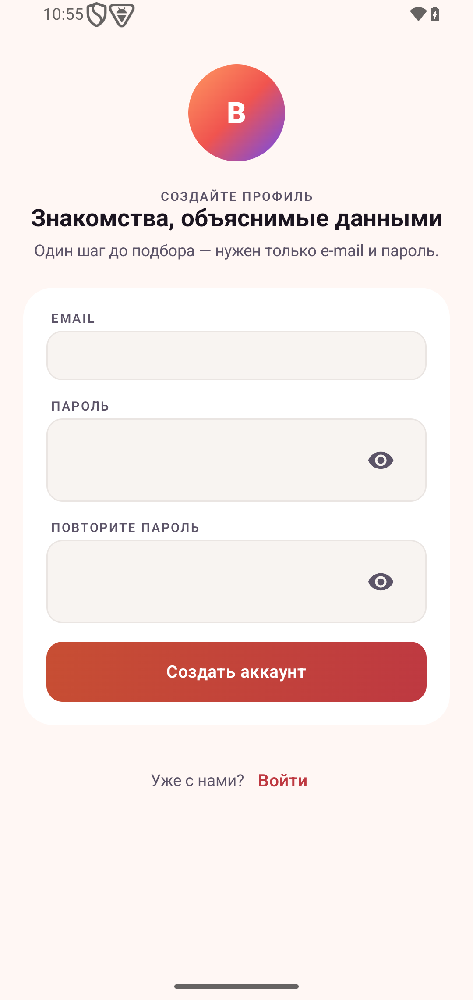
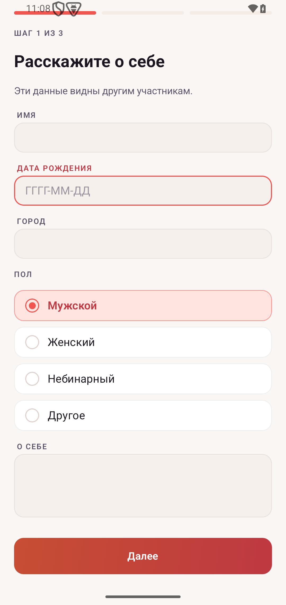
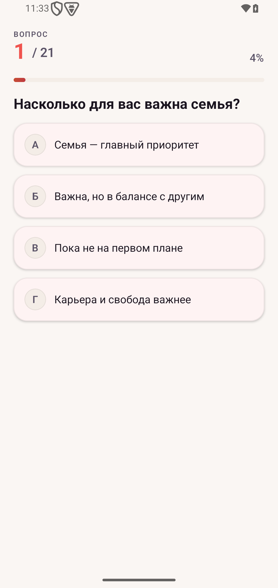
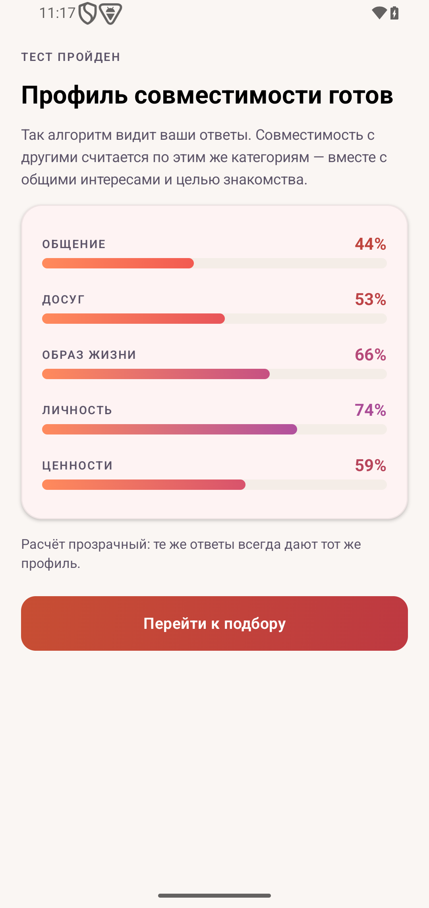
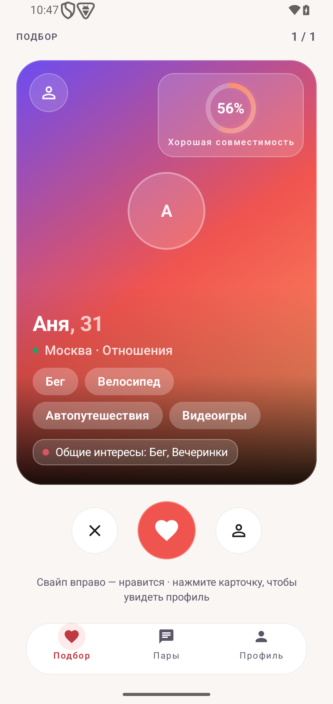
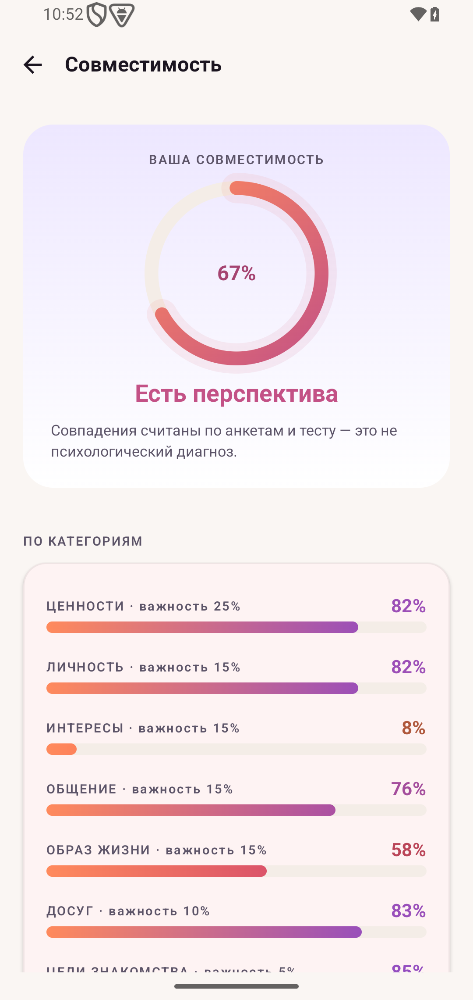
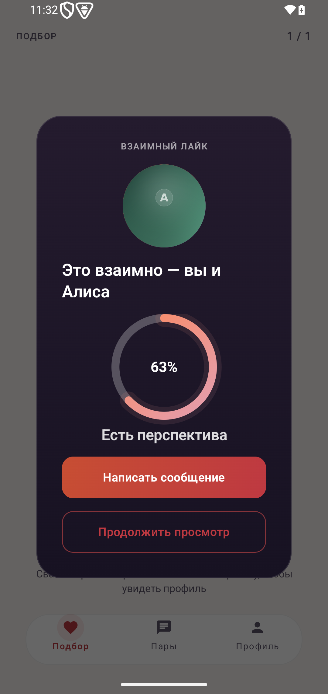
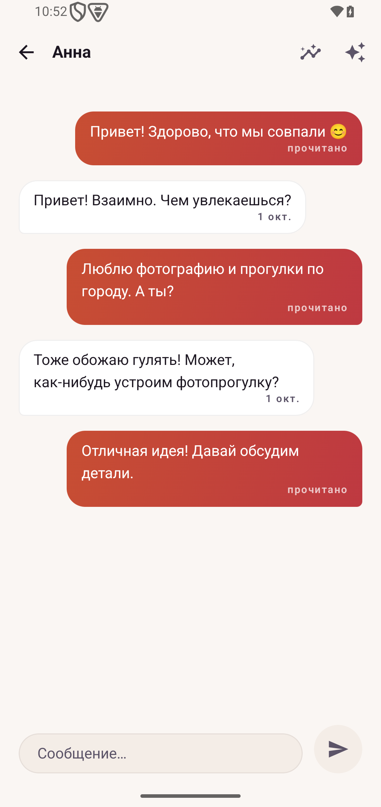
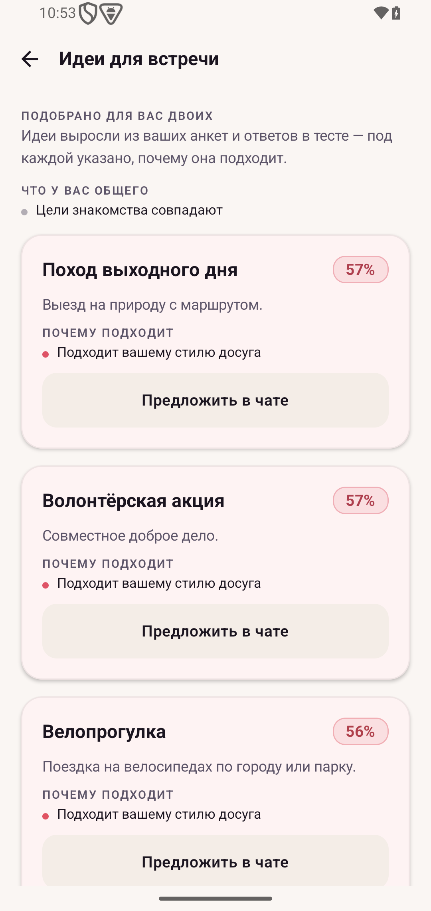
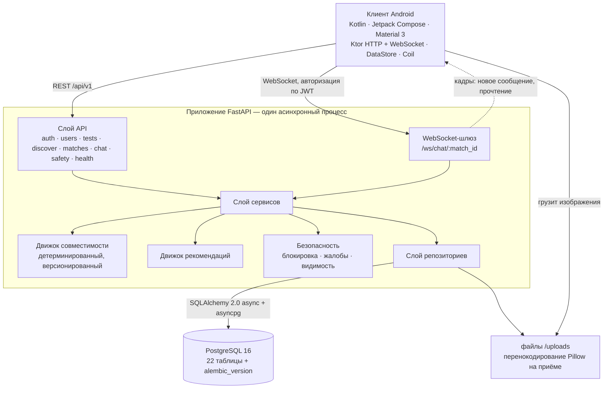

# BeFoS

**Платформа знакомств с объяснимой совместимостью**


| | | |
|---|---|---|
|  |  |  |
| Вход | Анкета | Тест |
|  |  |  |
| Результат теста | Поиск | Разбор совместимости |
|  |  |  |
| Взаимная симпатия | Чат | Рекомендации для свидания |

> BeFoS — платформа знакомств, в которой совместимость считается по семи взвешенным
> категориям и показывается человеку вместе с числом. Не «вот вам 87% и верьте на слово», а
> «вот что у вас общего, вот в чём вы разошлись, и вот чем вам двоим заняться вместе». Всё это
> вычисляется из реальных ответов профилей, детерминированно, без генерации текста.

Процент совместимости — **инженерная эвристика**, построенная на опросниках и тесте. Это не
психологическая или медицинская диагностика, и в продукте она нигде так не подаётся.

## Что это за проект

В одном репозитории два законченных артефакта:

- **`backend/`** — асинхронный FastAPI-сервис: JWT-аутентификация с ротацией refresh-токенов,
  профиль и анкета, тест из 21 вопроса, движок совместимости, поиск с хранимой колодой и
  пагинацией по курсору, пары, WebSocket-шлюз чата, рекомендации совместных активностей,
  безопасность (блокировка и жалобы), миграции Alembic поверх PostgreSQL 16.
- **`android/`** — клиент на Kotlin / Jetpack Compose (Material 3, Ktor, Navigation Compose,
  DataStore, Coil) с разбиением `data / domain / presentation`, покрывающий каждую возможность
  бэкенда выше.

В этом потоке нет заглушек: ни случайных процентов, ни фейковых профилей за интерфейсом, ни
имитации realtime-канала. Засеянные аккаунты существуют, чтобы продукт можно было показать, и
они помечены как засеянные.

## Почему BeFoS, а не очередное приложение для знакомств

Приложение для знакомств оптимизируют по времени в интерфейсе; ранжирование, которое даёт
колоду, непрозрачно, а матч ничего не говорит о том, почему случился. BeFoS переворачивает это:

- **Число объяснимо.** Каждый балл категории выведен из сохранённых ответов, и API возвращает
  разбор по категориям, точки совпадения, реальные расхождения и общие интересы — всё
  вычислено, ничего не сгенерировано.
- **Одинаковый вход даёт одинаковый выход.** Движок детерминирован и версионирован
  (`engine_version` сохраняется вместе с каждым результатом), поэтому процент можно
  воспроизвести и проверить.
- **Симметрия — проверенное свойство.** Пара получает одинаковый процент с обеих сторон; это
  утверждено тестами, а не принято по умолчанию.
- **Рекомендация применима.** Вместо «вам стоит поговорить» приложение предлагает конкретную
  активность из каталога, которая подходит обоим профилям, их городу и их ответам.
- **Отказ реальный.** Блокировка удаляет пару и её историю на сервере, в обе стороны, включая
  внутри уже открытого сокета. Это не фильтр ленты.

## Продуктовый поток

```
регистрация → профиль → интересы → тест из 21 вопроса → профиль совместимости
        → колода поиска → симпатия / пропуск → взаимный матч → чат (WebSocket)
        → разбор совместимости → рекомендация совместной активности
```

После входа маршрутизация зависит от того, насколько заполнен профиль: законченный попадает на
главную вкладку, незаполненный — обратно в анкету, а не на экран, который не может работать.

## Экраны

Сняты с работающего приложения на эмуляторе (1080×2280) против Docker-бэкенда, только на
засеянных демо-данных. Язык интерфейса — русский: продукт делался для русскоязычного рынка, а
строки экранов живут в коде Compose, а не в ресурсном бандле, поэтому переключателя локали нет.
Содержимое каталогов (интересы, вопросы, активности) по той же причине русское.

| Экран | Файл | Что на нём |
|---|---|---|
| Вход | [`01-auth.png`](screenshots/01-auth.png) | Форма входа и регистрации |
| Анкета | [`02-onboarding.png`](screenshots/02-onboarding.png) | Шаг 1 из 3: имя, дата рождения, город, пол, о себе |
| Тест | [`03-test.png`](screenshots/03-test.png) | Вопрос 1 из 21, с прогресс-баром и четырьмя вариантами |
| Результат теста | [`04-test-result.png`](screenshots/04-test-result.png) | Профиль по категориям после теста |
| Поиск | [`05-discovery.png`](screenshots/05-discovery.png) | Карточка кандидата с кольцом процента, общими интересами и причиной показа, выведенной из данных |
| Совместимость | [`06-compatibility.png`](screenshots/06-compatibility.png) | Общий процент и семь полос категорий |
| Матч | [`07-match.png`](screenshots/07-match.png) | Момент взаимной симпатии с процентом пары |
| Чат | [`08-chat.png`](screenshots/08-chat.png) | Живой диалог внутри пары |
| Рекомендации | [`09-recommendations.png`](screenshots/09-recommendations.png) | Оценённые для пары совместные активности |
| Профиль | [`10-profile.png`](screenshots/10-profile.png) | Свой профиль, состояние теста, интересы, вход в приватность |

## Что умеет

**Аутентификация и сессия.** Access-токен плюс refresh-токен; refresh хранится как SHA-256 хеш
и ротится при каждом использовании. Протухшая сессия — восстановимое состояние: неудачный
refresh очищает токены, а навигатор возвращает человека на экран входа с уже подставленной
почтой; 5xx или сетевой сбой, наоборот, сессию сохраняют и оставляют на экране, где «Повторить»
может сработать. Проверено на устройстве подменой JWT-секрета бэкенда.

**Профиль и анкета.** Три шага, валидация там, где уже находится большой палец; интересы из
каталога на 40 позиций со стабильной геометрией чипов (выбор одного не сдвигает соседей).

**Тест.** 21 вопрос в семи категориях, автопереход, автоотправка на последнем ответе, перепройти
можно в любой момент; ответы хранятся по вариантам и питают движок.

**Поиск.** Кандидаты берутся из хранимой ранжированной колоды и читаются курсором, поэтому
страницы не съезжают, пока пул меняется; тот, кто не проходил тест, не становится чьей-то
карточкой. На каждой карточке лежит `highlight`, выведенный из двух профилей, а не из шаблона.

**Пары и чат.** Взаимная симпатия создаёт пару и сохраняет процент, который движок даёт этой
паре сегодня. Сообщения уходят через REST и рассылаются в WebSocket пары, так что оба клиента
видят их без перезагрузки; повтор отправки переиспользует ключ идемпотентности, поэтому одно
касание — одно сообщение, а переподключение дозагружает пропущенный разрыв.

**Разбор совместимости.** Общий процент, семь полос категорий, сильные стороны, расхождения,
общие интересы — считается по обоим профилям.

**Рекомендации.** Активности, оценённые по обоим профилям, их городу и ответам, и обновляются,
когда меняется любой из профилей.

**Безопасность.** Блокировка (на сервере, в обе стороны, перепроверяется на каждом кадре
сокета), жалобы с пересылаемыми причинами, переключатель видимости профиля, удаление
аккаунта, которое стирает данные.

## Движок совместимости

```
Score = Σ ( normalize(component_i) × weight_i ),   Σ weight_i = 1.0
```

| Категория | Вес | Из чего считается |
|---|---|---|
| values | 0.25 | Близость черт в нормализованном векторе ответов (семья, карьера, рост, стабильность, приключения) |
| personality | 0.15 | Близость черт (экстраверсия, открытость, планирование, оптимизм) |
| interests | 0.15 | Пересечение множеств интересов двух людей — не вектора |
| communication | 0.15 | Близость черт в категории общения |
| lifestyle | 0.15 | Близость черт в категории уклада жизни |
| leisure | 0.10 | Близость черт в категории досуга |
| goals | 0.05 | Совместимость двух названных целей знакомства — не вектора |

Веса лежат в `backend/app/compatibility/weights.py` и проверены на сумму 1.0; версия движка
записывается в каждый сохранённый результат, то есть число хранит правила, по которым оно
посчитано. Кроме процента API отдаёт разбор по категориям, сильные стороны, расхождения и общие
интересы. Оценивание — чистая синхронная функция двух векторов: без базы, без часов, без
случайности внутри движка. Именно поэтому тесты детерминизма и симметрии дёшевы в запуске.

## Архитектура



Один процесс бэкенда, одна база и одно хранилище файлов для загрузок: ни очереди, ни кэш-слоя,
ни микросервиса, которого не существует. [`docs/ARCHITECTURE.md`](docs/ARCHITECTURE.md) описывает
слои, движки и жизнь сокета; [`docs/DATABASE.md`](docs/DATABASE.md) — схему и арифметику пула;
[`docs/API.md`](docs/API.md) — каждый эндпоинт; [`docs/DEPENDENCIES.md`](docs/DEPENDENCIES.md) —
политику пинов, аудит advisory и что именно он замерил.

## Технологический стек

| Слой | Технология |
|---|---|
| Бэкенд | Python 3.12, FastAPI 0.115, Pydantic 2.10, SQLAlchemy 2.0 (async), asyncpg, Alembic 1.14 |
| База данных | PostgreSQL 16 |
| Аутентификация и безопасность | JWT (access + ротируемый refresh, refresh лежит как SHA-256 хеш), bcrypt, проверка CORS, скользящее окно rate limiting, перенкодирование изображений через Pillow |
| Realtime | WebSocket `/ws/chat/{match_id}` с авторизацией по JWT; сообщения и прочтения, отправленные по REST, рассылаются в сокет пары |
| Android | Kotlin 2.2, Jetpack Compose (BOM 2024.09), Material 3, Navigation Compose 2.8, Ktor 3.0, kotlinx-serialization, Coil 2.7, DataStore 1.1, Coroutines/Flow |
| Инфраструктура | Docker Compose, GitHub Actions, pytest, JUnit4 + MockK + Turbine |

## Безопасность

Реализовано и покрыто тестами:

- **Аутентификация на JWT**: access-токен (по умолчанию 30 минут) и refresh-токен (по
  умолчанию 30 дней), который **ротится при каждом использовании**; в покое refresh существует
  только как SHA-256 хеш, никогда — как значение, которое держит клиент.
- **Хеширование паролей bcrypt**; пароли не пишутся в логи, как и access/refresh-токены, —
  включая токен, который появляется в рукопожатии WebSocket.
- **Авторизация на уровне объекта (защита от IDOR)** на каждом маршруте с идентификатором, с
  отдельным прогоном тестов, который утверждает, что чужой id отвергнут, а не просто скрыт. Сюда
  же входит видимость: `GET /users/{id}`, `POST /users/{id}/like` и `/pass` проверяют цель одним
  правилом — тем, которым колода решает, кого показывать, — поэтому спрятанный, отключённый или не
  прошедший анкету профиль отвечает 404 и на чтении, а не только в ленте. Отказ всегда один и тот
  же, `404`, включая маршруты пары: `403` подтвердил бы, что такая пара существует, и по разнице
  ответов пару можно было бы перебирать. Набор маршрутов берётся из таблицы маршрутов приложения,
  а не из списка, кто-то когда-то написанный, поэтому новый маршрут с идентификатором попадает
  под проверку в коммите, который его подключил.
- **Авторизация WebSocket**: рукопожатие проверяет JWT и принадлежность паре, и каждый кадр уже
  открытого сокета перепроверяет их, поэтому сокет не может пережить свою пару, блокировку или
  отключение аккаунта — close `1008`. Перепроверяется и кадр
  «печатает» — он доходит до экрана другого человека, значит спрашивает строки не дешевле, чем
  сообщение.
- **Ограничение частоты запросов** скользящим окном: 120 запросов в минуту на каждый маршрут
  кроме `/health`, 20 в минуту на `/auth`, 60 в минуту на `/health/db`, 30 рукопожатий в минуту
  на адрес для WebSocket и 120 кадров в минуту на аккаунт внутри соединения. Ключ берётся по
  адресу соединения, а не по `X-Forwarded-For`, который клиент подделывает сам; `/health` оставлен
  без лимита, потому что монитор, получивший 429, объявит сервис мёртвым в чужой час пик, а
  `/health/db` ограничен, потому что каждый его запрос берёт соединение из пула, который делят
  настоящие пользователи.
- **Документация API закрыта в production**: `/docs`, `/redoc` и `/openapi.json` не отвечают, а
  корневой ответ не ссылается на них. OpenAPI-документ перечисляет каждый маршрут с
  идентификатором и его параметры, а `/docs` умеет слать запросы прямо из браузера; на стенде это
  удобный способ прочитать контракт, на публичном хосте — карта для того, кто её сканирует.
- **Безопасное логирование**: структурированные логи запросов несут id запроса, маршрут, статус
  и длительность и никаких персональных данных пользователя.
- **Проверка загрузок**: изображение читается до потолка по размеру и перенокодировается через
  Pillow, поэтому файл слишком большой или испорченный отвергается как вход, а не превращается
  в 500 или decompression bomb. Декодер выбирается из списка, который принадлежит этому продукту
  (`ACCEPTED_PIL_FORMATS`), а не из байтов, которые клиент сам подписал: `Image.open` берёт
  парсер из магических чисел в теле, и без вторых ворот объявленный JPEG PSD или TIFF доезжает до
  декодера, который фото не нужен.
- **Сторонние компоненты**: runtime-зависимости запинены точно, тестовый инструментарий лежит в
  отдельном файле, чтобы рабочий образ не нёс тест-раннер, а разрешённый граф — 39 pip-артефактов
  и 165 Maven-артефактов — проверяем на аудит-базе GitHub скриптом
  `backend/ops/check_advisories.py`. Политика, список alert'ов и то, что было оставлено намеренно:
  [`docs/DEPENDENCIES.md`](docs/DEPENDENCIES.md).
- **Проверка production-конфигурации**: при `ENVIRONMENT=production` сервис не стартует на
  заглушечном или коротком JWT-секрете, на совпадающих секретах access и refresh, на wildcard-
  или `http://` CORS-origin, на `DEBUG=true`, на включённом демо-аккаунте (его пароль напечатан
  в этом репозитории, значит это общий доступ, а не удобство), на пароле базы, который репозиторий
  кладёт для разработки, и на неразпознанном значении самого `ENVIRONMENT` — опечатка в нём иначе
  молча выключила бы все остальные проверки.
- **Удаление аккаунта как жизненный цикл данных**: строка остаётся, чтобы целость ссылок и
  история пар выжили, а всё, что ещё описывает человека, стирается — ответы теста, результаты,
  вектор совместимости, привязанность к активностям, записи колоды — при этом `birth_date`, `gender`,
  `dating_goal` и предпочтения выставляются в значения, которые ни одна форма не выдаст. Строки
  загруженных фото и их файлы тоже удаляются, потому что `/uploads` — открытая статика, и скрытие
  профиля не мешает отдавать URL. Жалобы удалению переживают намеренно.
- **Блокировка и жалобы**: блокировка убирает пару и её сообщения, отвечает 404 на историю и на
  отправку в обе стороны и перепроверяется при рукопожатии сокета и на каждом кадре.
- **Проверка CORS**: wildcard-origin вместе с credentials отвергается на старте.

Этот раздел намеренно опускает детали реализации, которые облегчили бы злоупотребление;
поведенческие гарантии выше — то, что утверждает тестовый набор.

## Надёжность

- **Миграции** — ревизии Alembic, применяются при старте контейнера; `alembic check` чист
  относительно моделей, и у каждой ревизии есть работающий путь downgrade.
- **Резервные копии** оформлены как процедура с проверенным дроллем восстановления: `pg_dump`,
  отпечаток-запрос, восстановление в черновую базу, сравнение, удаление. Копия, которую не
  восстанавливали, — не резервная копия, поэтому дролл записан вместе с числами в
  [`docs/OPERATIONS.md`](docs/OPERATIONS.md).
- **Пробы здоровья**: liveness-эндпоинт и readiness-эндпоинт с проверкой базы, чтобы
  оркестратор отличал «процесс жив» от «могу обслуживать».
- **Арифметика пула** задокументирована, а не угадана: размер, overflow и `pool_recycle`
  обоснованы относительно `max_connections` Postgres в этом стенде.
- **Гонки закрыты ограничениями**: повторные симпатии, двойная отправка теста и одинаковые
  сообщения решают база данных, а не схема check-then-insert на Python. То же касается колоды:
  ранг — это шаг курсора, поэтому уникальный индекс по `(viewer_id, rank)` не даёт двум
  одновременным добивкам поставить две карточки на один шаг, из-за чего одна из них пропала бы
  из поиска молча.
- **Идемпотентность чата**: отправка несёт клиентский ключ, поэтому повтор после потерянного
  ответа сохраняет одно сообщение; переподключение подтягивает то, что пропустил сокет.
- **Наблюдаемость**: каждый запрос получает id, длительность и структурированную строку — именно
  это сделало правки задержек и N+1 измеримыми.
- **Производительность**: лента поиска и список пар перестали платить N+1; два горячих чтения,
  которые сканировали всю таблицу, сканируют страницу; поиск читает хранимую колоду вместо
  ранжирования пула на каждый запрос; вход по адресу читается индексом по выражению
  `lower(email)`, а не полным обходом таблицы — проверено планом, который до правки печатал
  `Seq Scan on users`. Потолок количества запросов утверждён тестами.
- **Целостность релиза**: release-сборку нельзя собрать против адреса эмулятора — упаковка
  падает, если явно не переданы `https://`/`wss://` адреса бэкенда, и проверка сделана по тем
  артефактам, которые действительно производит граф задач.
- **Непрерывная проверка**: пять job'ов GitHub Actions (`backend`, `migrations`, `android`,
  `advisories`, `journey`) гоняют эти же команды на чистом runner'е, так что процитированные ниже
  числа перестали быть ручными замерами. PR с регрессией становится красным.

## Тесты

Эти числа стоит перепроверить перед тем, как цитировать; бэкенд-строка снята 2026-10-07,
остальные — на этом же дереве:

| Набор | Результат | Команда |
|---|---|---|
| Бэкенд (юнит + интеграция + security config + IDOR + perf + пагинация + наблюдаемость + надёжность БД + медиа + идемпотентность чата + квитанция о прочтении при открытии + мультисессионная рассылка read/typing + согласованность совместимости + регрессии зависимостей + race-условия колоды + границы возраста колоды + гонка взаимного like в матчме + гонка block и like + атомарность ротации refresh-токена + гонка отправки в распущенный матч + планы запросов + страж одной pytest-сессии + sweep по таблице маршрутов + потолки пробы и сокета) | **269 passed** | `cd backend && pytest` |
| Android unit (ViewModel и чистые функции) | **131 passed, 0 failed** | `cd android && ./gradlew :app:testDebugUnitTest` |
| Живой продуктовый путь против работающего Docker-бэкенда, два настоящих аккаунта | **64 / 64 проверок** | `cd backend && python e2e_journey.py` |
| Запуск на устройстве | вручную, полный поток: регистрация → анкета → тест → поиск → матч → чат → совместимость → рекомендации → пары → профиль → настройки → выход → повторный вход | AVD `befos_avd` (pixel_4, 540×1140 / плотность 220), headless |

Бэкенд-набор создаёт собственную базу `befos_test` против Docker Postgres на
`localhost:5432`, поэтому единственное предусловие — работающий `docker compose up -d`; целевой
кластер переопределяется через `BEFOS_TEST_PG_HOST/PORT/USER/PASSWORD` и имя базы —
`BEFOS_TEST_DB`.

Набор держит базу по одной сессии: `conftest.py` берёт advisory-лок на время прогона, и вторая
сессия против той же базы получает отказ старта с указанием причины, а не 13 падений, которые
выглядят как регрессии. Так сделано потому, что фикстура `client` вычищает доменные таблицы перед
каждым тестом, и две параллельные сессии стирают строки друг друга; замер 2026-10-06 — второй
прогон против уже занятой базы был отказан, тогда как без охраны он дал `13 failed / 229 passed`
на дереве, которое проходит целиком.

E2E-путь ведёт всю цепочку создания ценности двумя настоящими аккаунтами — регистрация, анкета,
тест, поиск, взаимная симпатия, матч, чат через сокет, совместимость, рекомендации,
блокировка/видимость, refresh, выход, повторный вход, удаление аккаунта — плюс негативные
проверки безопасности, включая причину показа карточки, выведенную из данных.

Геометрия и ввод измеряются, а не оцениваются на глаз: матрица адаптивности 320/360/411/540 dp при
масштабе текста до 1.3, клавиатура/IME на каждом текстовом экране и геометрия чипов интересов
(касание не сдвигает ни одного из шести соседей; область касания чипа — ровно 48 dp).

## История разработки

Шесть дней истории, сохранённые целиком, а не сплющенные — вытесненные версии по-прежнему
адресуются коммитом. Пересчитать в любой момент: `git rev-list --count HEAD`.

| Этап | Когда | Что изменилось |
|---|---|---|
| Фундамент | 2026-10-01 | Бэкенд с движком совместимости, клиент на Compose, первые тесты, первые документы |
| Realtime, правила сессий, производительность | 2026-10-02 | WebSocket-чат, маршрутизация сессий, fail-fast конфигурация, набор IDOR, удаление N+1, подпись релиза |
| Визуальный редизайн | 2026-10-02 | Система токенов и пересборка компонентов, перенос каждого экрана |
| Качество UX | 2026-10-03 | Честные состояния отказа, скелетоны, состояние навигации, голос текстов |
| Adversarial QA, надёжность | 2026-10-04 | Лимитер по подделанному заголовку, гонки, жизнь сокета, лимиты медиа, наблюдаемость, идемпотентность |
| Доступность, приватность, согласованность движка | 2026-10-05 | Матрица клавиатуры/IME, контраст, цикл удаления, симметричные проценты, production-стражи |
| Готовность к запуску | 2026-10-06 | Правила gitignore, база только на loopback, сторож за shipped-паролем, лицензия, скриншоты |
| Усиление зависимостей | 2026-10-06 | 40 alert'ов закрыты четырьмя пинами, белый список декодеров, двухстадийный non-root образ, инструмент аудита advisory, 44 новые регрессии |
| Конвейер и проверки на runner'е | 2026-10-06 | Пять job'ов GitHub Actions, executable-бит `gradlew`, Dependabot, шаблоны issue и PR, еженедельный пересмотр графов и CodeQL по Python |
| Пять правок первой очереди | 2026-10-06 | Лимитер на всех маршрутах кроме `/health`, видимость на путях симпатии и пропуска, сброс колоды и процентов после анкеты, уникальный ранг в колоде с миграцией, индекс под `lower(email)` |
| Аудит таблицы маршрутов | 2026-10-06 | Один 404 на маршрутах пары вместо 403-оракула, правило колоды на чтении чужого профиля, окна для пробы базы и для сокета, перечитывание авторизации на `typing` и `read`, закрытая в production документация, набор проверок, выведенный из `create_app().routes` |
| Adversarial-разбор: чат, колода, сокет | 2026-10-07 | Квитанция «прочитано» при открытии чата через `GET /messages`, строгая нижняя граница возраста колоды и кламп дня на 29 февраля, рассылка read/typing по пользователю, а не по одному сокету (PR #7, PR #9) |
| Гонка взаимного like | 2026-10-07 | `like` берёт транзакционную advisory-блокировку на паре: два like в один миг перестают терять пару (PR #10) |
| Гонка block и like | 2026-10-07 | `block` берёт тот же pair-лок, а `like` перечитывает блокировку под локом: блок в один миг с like больше не оставляет заблокированную пару сматченной (PR #11) |
| Гонка ротации refresh | 2026-10-07 | отзыв refresh-токена стал условным `UPDATE ... WHERE revoked = false`: один токен, пришедший дважды в один миг, ротируется один раз и даёт одну сессию, а не две (PR #12) |
| Гонка отправки в распущенный матч | 2026-10-07 | `send` берёт тот же pair-лок и перечитывает наличие матча через запрос по id-колонке, а не через карту идентичности: сообщение в матч, только что снесённый блоком, отвечает 404, а не 500, и не оставляет сироты (PR #13) |

Подробности по этапам, с доказательствами коммитов для каждой строки:
[`docs/DEVELOPMENT_HISTORY.md`](docs/DEVELOPMENT_HISTORY.md).

## Локальный запуск

### Бэкенд в Docker (рекомендуется)

```bash
cp .env.example .env        # при желании поменяйте секреты
docker compose up --build
```

Compose поднимает PostgreSQL и бэкенд, применяет миграции (`alembic upgrade head`), засевает
каталоги и демо-данные (`python -m app.seed --if-empty`) и отдаёт API на
`http://localhost:8000`. Интерактивная документация: `http://localhost:8000/docs`.

Development-файл compose публикует PostgreSQL только на `127.0.0.1:5432`, поэтому случайный
`docker compose up` на машине с маршрутизируемым интерфейсом базу не выставляет наружу.

### Бэкенд без Docker

```bash
cd backend
python -m venv .venv && source .venv/Scripts/activate   # Windows, Git Bash
pip install -r requirements-dev.txt                      # runtime + тестовый инструментарий
cp ../.env.example .env                                  # направьте DATABASE_URL на свою PostgreSQL
alembic upgrade head
python -m app.seed
uvicorn app.main:app --reload --port 8000
```

`requirements.txt` ставится в контейнер — только runtime, запиненный точно.
`requirements-dev.txt` подтягивает этот файл и добавляет `pytest`, `pytest-asyncio` и `httpx`,
которые в образ не попадают. Пины и причины за ними:
[`docs/DEPENDENCIES.md`](docs/DEPENDENCIES.md).

### Android

Откройте `android/` в Android Studio или соберите из CLI:

```bash
cd android
./gradlew :app:assembleDebug     # app/build/outputs/apk/debug/app-debug.apk
```

Эмулятор достаёт до хоста через `10.0.2.2`, поэтому бэкенд на `localhost:8000` не требует
дополнительной конфигурации (см. `API_BASE_URL` в `android/app/build.gradle.kts`). Физическое
устройство может использовать `adb reverse tcp:8000 tcp:8000`.

### Release-сборка

```bash
cd android
export BEFOS_API_BASE_URL="https://api.example.com/" BEFOS_WS_BASE_URL="wss://api.example.com/"
# подпись по желанию: скопируйте android/keystore.properties.example в android/keystore.properties
# (вне git). Без неё сборка честно производит неподписанный APK/AAB — никогда debug-ключ.
./gradlew :app:assembleRelease :app:bundleRelease
```

Без этих двух переменных упаковка падает с понятным сообщением: случайный release, указывающий
на HTTP-адрес эмулятора, невозможен. Адрес должен быть `https://`/`wss://`, не содержать
credentials и не быть `localhost`/`10.0.2.2`. Подпись, проверка артефактов через `apksigner`,
R8-маппинг и чек-лист перед публикацией — в [`docs/RELEASE.md`](docs/RELEASE.md).

### Тесты

```bash
cd backend && pytest                                   # 269
cd android && ./gradlew :app:testDebugUnitTest         # 131
cd backend && python e2e_journey.py                    # 64 проверки, нужен поднятый Docker-бэкенд
```

Зависимости проверяются так же, как наборы тестов — запуском чего-то, а не доверием бейджу:

```bash
docker exec befos_backend python -m pip freeze | python backend/ops/check_advisories.py --pip-stdin
```

Скрипт спрашивает аудит-базу GitHub про *разрешённый* граф и возвращает 1 при любом попадании;
[`docs/DEPENDENCIES.md`](docs/DEPENDENCIES.md) содержит команду для Gradle-стороны и замер
2026-10-06.

## Демо

При `DEMO_ENABLED=true` (значение по умолчанию в `.env.example`, в production отвергается):

```
email:    demo@befos.app
password: Demo12345
```

Посев создаёт ещё 50 очевидно вымышленных демо-персон с синтетическими ответами, чтобы поиску,
матчингу и рекомендациям было на чём считать. При `DEMO_ENABLED=false` посев грузит только
каталоги (интересы, вопросы, активности) и никого не выдумывает.

[`DEMO.md`](DEMO.md) — сценарий на 5–10 минут по всей цепочке создания ценности (шаги 0–17 в том
порядке, в котором продукт показывают), включая проверку realtime-кадров и два необратимых
действия, которые делают на одноразовом аккаунте.

## Состояние проекта

Работает и проверено: всё, что описано в потоке выше, на текущем дереве, на эмуляторе и против
Docker-бэкенда — плюс три набора тестов и живой путь.

Не сделано, сказ прямо:

- **Нет развёртывания.** Сервис работает локально или в Docker Compose на одном хосте; внешнего
  запущенного инстанса, терминирования TLS и настоящего боевого окружения нет. Конвейер поднимает
  собранный образ и ведёт живой путь на runner'е, но это проверка, а не запуск: среда живёт
  столько, сколько длится job, и наружу ничего не выставлено.
- **Нет push-уведомлений.** Дизайн относительно существующих швов записан
  (`docs/ARCHITECTURE.md`), реализации нет — намеренно: она требует ключ сервиса Firebase Cloud
  Messaging, а своего проектного ключа в этом репозитории нет и придумать его нельзя.
- **Нет панели администратора.** Жалобы сохраняются и переживают удаление аккаунта автора, но
  читать и разбирать их сейчас значит SQL (`docs/OPERATIONS.md` §14).
- **Разблокировки в приложении нет.** Для клиента блокировка окончательна; снятие —
  задокументированная SQL-операция, которая не восстанавливает пару и её историю.
- **Резервные копии ручные.** Есть проверенный дролл, а не планировщик, и нет копии вне хоста.
- **Нет восстановления в момент времени.** Recovery point — последний дамп.
- **Одна база, без реплики.** Тяжёлый отчёт выполняется на рабочих соединениях.
- **`/uploads` — неаутентифицированная статика.** Приватность там держится на непредсказуемых
  именах файлов и на удалении файла вместе с аккаунтом, а не на проверке прав.
- **Юнит-тесты Android требуют ASCII-пути на Windows.** Из директории с не-ASCII символами
  Gradle test worker умирает с `ClassNotFoundException` на каждом классе
  (`sun.jnu.encoding=Cp1251`); те же 131 тест проходят из ASCII-пути, как и прошли для чисел
  выше. Сборки приложения это не касается.
- **Клонируйте Android без `--depth`.** Из shallow-клона этого репозитория граф задач Gradle не
  разрешается: `Could not determine the dependencies of task ':app:testDebugUnitTest'` с
  `java.io.IOException`, — тогда как тот же коммит из полного клона собрался и прогнал все 131
  тест. Бэкенд и контейнерный образ от способа клона не зависят.

## Дорожная карта

В том порядке, в котором перечисленные пробелы реально что-то блокируют:

1. Выставить бэкенд за TLS с настоящими секретами и доказать production-стражи на живом
   окружении, а не на локальном.
2. Push-уведомления по уже записанному дизайну (хранение токена устройства, правила доставки по
   парам, отказ от рассылок) — как только появится ключ сервиса FCM.
3. Читалка жалоб для модерации, чтобы у претензии был адресат, отличный от приглашения `psql`.
4. Плановые резервные копии с копией вне хоста и периодически повторяемым дроллом восстановления;
   PITR после этого.
5. Разблокировка в приложении с явным утверждением, что она не воскресает удалённую пару.
6. Подписанная дистрибуция релиза (закрытый трек Play) и политика версионирования поверх
   существующих release-ворот.

## Лицензия

Проприетарная. **All Rights Reserved** — см. [`LICENSE`](LICENSE).

> © 2026 Andrew Kolesnikov. All rights reserved.
> The repository is published for portfolio, educational review and demonstration purposes.
> No license is granted to copy, redistribute, modify, sublicense or commercially use the
> source code without explicit written permission.

Отсутствие open-source лицензии — не забывчивость: разрешение на открытое использование здесь не
выдаётся, и **использовать код нельзя** — это касается и переноса движка совместимости, и
заимствования модуля, и встраивания APK, и хостинга копии. Читать код и историю и собирать его
локально без изменений для ревью или учёбы — можно, как и короткие цитаты с указанием авторства;
точные условия — в `LICENSE`. Сторонние компоненты остаются под своими лицензиями и перечислены в
[`THIRD_PARTY_NOTICES.md`](THIRD_PARTY_NOTICES.md). Это прямое изложение намерений автора, а не
юридическая консультация.

BeFoS ведётся как проприетарный portfolio/product-проект. **Внешние вклады сейчас не
принимаются** — `CONTRIBUTING.md` нет, pull request'ы не мёржатся. Запросить разрешение можно
через GitHub-профиль автора (Andrew05812).
